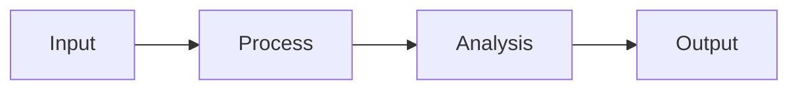

# Slide Deck Generation Command


## ⚠️ Argument Required

**Input received:** `$ARGUMENTS`

**If no argument is provided**, display this help information and stop:

```
━━━━━━━━━━━━━━━━━━━━━━━━━━━━━━━━━━━━━━━━━━━━━━━━━━━━━━━━━━━━━━━━━━━━━━
Slide Deck Generation Command
━━━━━━━━━━━━━━━━━━━━━━━━━━━━━━━━━━━━━━━━━━━━━━━━━━━━━━━━━━━━━━━━━━━━━━

DESCRIPTION:
  Generate presentation slide deck from research content in Marp/reveal.js format

USAGE:
  /notebooklm-generate-slides Topic name or path to knowledge base content

REQUIRED ARGUMENTS:
    Topic name or path to knowledge base content

OPTIONAL ARGUMENTS:
    (none)

EXAMPLES:
  /notebooklm-generate-slides "example-argument"

━━━━━━━━━━━━━━━━━━━━━━━━━━━━━━━━━━━━━━━━━━━━━━━━━━━━━━━━━━━━━━━━━━━━━━
Run the command with required arguments to proceed.
━━━━━━━━━━━━━━━━━━━━━━━━━━━━━━━━━━━━━━━━━━━━━━━━━━━━━━━━━━━━━━━━━━━━━━
```

**If arguments ARE provided**, proceed with the command below.

---
## Purpose
Transform research content into professional presentation slide decks. Output in Marp-compatible markdown that renders to PDF/HTML and works with reveal.js.

## Input Options

### Option 1: Topic Name
```
/notebooklm-generate-slides "OMOP CDM Overview"
```

### Option 2: Knowledge Base Path
```
/notebooklm-generate-slides ingested/manifest.md
```

### Option 3: Specific Document
```
/notebooklm-generate-slides docs/research/study-results.md
```

## Execution Workflow

### Phase 1: Content Analysis
1. Load source content
2. Identify presentation structure:
   - Main topic and subtopics
   - Key concepts to explain
   - Data and statistics
   - Diagrams and visuals needed
   - Code examples (if applicable)

### Phase 2: Outline Generation
Create presentation outline:
1. Title slide
2. Agenda/Overview
3. Content slides (grouped by section)
4. Visual slides (diagrams, charts)
5. Conclusions/Takeaways
6. Resources/Q&A

### Phase 3: Slide Generation
For each slide:
- Clear, focused title
- 3-5 bullet points max
- Visual elements where appropriate
- Speaker notes (optional)

### Phase 4: Visual Enhancement
Add Marp directives:
- Background images
- Mermaid diagrams
- Code syntax highlighting
- Two-column layouts
- Custom styling

## Output Format

```markdown
---
marp: true
theme: default
paginate: true
header: '[Topic] | Research Presentation'
footer: 'Generated by Research Hub'
---

# [Presentation Title]
## [Subtitle]

**Presenter Name**
*Organization*

Date: YYYY-MM-DD

---

# Agenda

1. Introduction & Background
2. Key Concepts
3. Methodology
4. Results
5. Discussion
6. Conclusions

---

# Introduction

## Background

- Context point 1
- Context point 2
- Context point 3

> "Impactful quote or statistic"

---

# Key Concept 1

## Definition

[Clear, concise definition]

## Why It Matters

- Importance point 1
- Importance point 2


---

# Process Overview



---

# Key Findings

| Metric | Value | Change |
|--------|-------|--------|
| Metric 1 | 100 | +50% |
| Metric 2 | 80 | +19% |

---

# Code Example

```sql
SELECT person_id, condition_concept_id
FROM cdm.condition_occurrence
WHERE condition_concept_id = 201826;
```

---

# Conclusions

## Key Takeaways

1. ✅ Takeaway 1
2. ✅ Takeaway 2
3. ✅ Takeaway 3

---

# Questions?

## Thank You!

**Contact**: email@example.com

---

<!-- Speaker Notes -->
<!--
## Slide 3 Notes

Key points to emphasize:
- Point 1 detail
- Point 2 detail

Timing: ~2 minutes
-->
```

## Slide Types

| Type | Purpose | Content |
|------|---------|---------|
| Title | Opening | Title, subtitle, presenter, date |
| Agenda | Overview | Numbered sections |
| Content | Information | Title + 3-5 bullets |
| Visual | Diagrams | Mermaid/images |
| Code | Examples | Syntax-highlighted code |
| Data | Statistics | Tables/charts |
| Quote | Emphasis | Impactful statement |
| Two-Column | Comparison | Side-by-side |
| Conclusion | Takeaways | Key points |
| Q&A | Closing | Contact info |

## Duration Guidelines

| Presentation | Slides | Time per Slide |
|--------------|--------|----------------|
| Lightning (5 min) | 5-8 | 45 sec |
| Short (15 min) | 12-18 | 1 min |
| Standard (30 min) | 25-35 | 1 min |
| Long (45 min) | 35-50 | 1 min |
| Workshop (60 min) | 45-60 | 1 min |

## Marp Directives

### Global (Frontmatter)
```yaml
---
marp: true
theme: default        # default, gaia, uncover
paginate: true        # Page numbers
header: 'Header text'
footer: 'Footer text'
backgroundColor: white
---
```

### Local (Per Slide)
```markdown
<!-- _class: lead -->     # Large centered title
<!-- _class: invert -->   # Dark theme
<!-- _paginate: false --> # Hide page number
```

### Images
```markdown
           # Full background
      # Left half
 # Right 40%
  # Inline sized
```

## Export Commands

```bash
# PDF export
marp slides.md -o slides.pdf

# HTML export
marp slides.md -o slides.html

# Presentation server
marp slides.md --server

# Watch mode
marp -w slides.md
```

## Output Location

```
output/slides/[topic]/
├── [topic]_slides.md          # Marp source
├── [topic]_slides.pdf         # PDF export
├── [topic]_slides.html        # HTML export
├── [topic]_notes.md           # Speaker notes
└── images/                    # Slide images
    ├── diagram1.svg
    └── chart1.png
```

## Usage Examples

### Generate from Topic
```
/notebooklm-generate-slides "OHDSI Cohort Definitions"
```

### Generate Short Presentation
```
/notebooklm-generate-slides "OMOP Overview" --duration 15
```

### Generate with Speaker Notes
```
/notebooklm-generate-slides "Study Results" --notes
```

## Success Criteria

Slide generation complete when:
- [ ] Content analyzed and structured
- [ ] All sections covered
- [ ] Visual elements included
- [ ] Marp directives applied
- [ ] Speaker notes added (if requested)
- [ ] Files saved to output location

## Example Output

```
📊 Slide Deck Generation Complete

📁 Output: output/slides/omop-cdm/omop-cdm_slides.md

📋 Statistics:
- Total Slides: 18
- Content Slides: 12
- Visual Slides: 4
- Other: 2 (title, Q&A)

⏱️ Estimated Duration: 20 minutes

📑 Sections:
1. Introduction (3 slides)
2. CDM Structure (5 slides)
3. Vocabularies (4 slides)
4. Implementation (4 slides)
5. Conclusion (2 slides)

🔧 Export Commands:
marp output/slides/omop-cdm/omop-cdm_slides.md -o slides.pdf

✅ Ready for presentation!
```
