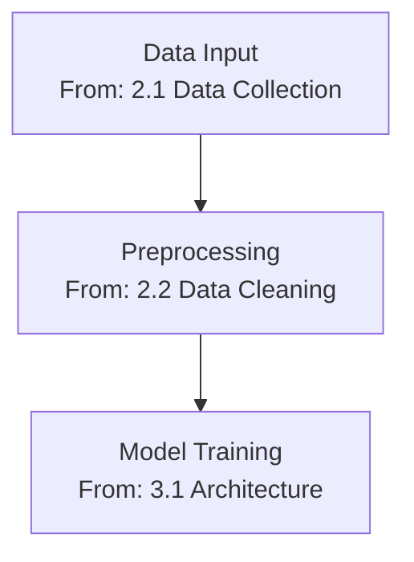

# Master Command Implementation Plan
## `/research-start-analysis` - Complete End-to-End Analysis

**Date Created**: 2025-11-09
**Version**: 1.0
**Status**: Implementation Ready

---

## Executive Summary

This document outlines the complete implementation plan for the `/research-start-analysis` master command, which orchestrates all 6 research-hub profile agents to perform comprehensive document analysis from parsing through publication-ready blog post generation.

### Key Innovation: Heading Preservation & Traceability

The core innovation in this workflow is **complete heading preservation** throughout the entire analysis pipeline. Every agent references and preserves the original document's heading structure, ensuring full traceability from source to final output.

---

## 1. Command Overview

### Purpose
Execute a complete end-to-end analysis of any supported document (PDF, DOCX, CSV, EXCEL, TEXT, JPG, PNG, GIF), generating 7+ comprehensive artifacts ready for study, reference, and publication.

### Command Sequence
1. **Document Parsing** → Extract headings, content, structure
2. **Clinical Workflow Analysis** → Map clinical processes with heading references
3. **Technical Workflow Analysis** → Map technical processes with heading references
4. **Mind Map Generation** → Create 3 mind maps (clinical, technical, combined)
5. **Research Summary** → Organize insights by original headings
6. **Blog Post Generation** → Publication-ready article with full citations

### Time Estimate
60-90 minutes for complete analysis (automated)

### Output Package
- 1 Parsed document with heading hierarchy
- 1 Clinical workflow document
- 1 Technical workflow document
- 3 Mind maps (clinical, technical, combined)
- 1 Research summary document
- 1 Publication-ready blog post
- Social media snippets
- All referenced images and diagrams

---

## 2. Critical Requirement: Heading Preservation

### Why This Matters
Without heading preservation, generated workflows and analyses lose their connection to the source material. Readers cannot trace claims back to original sections. This breaks the educational value of the output.

### Implementation Strategy

#### Phase 1: Extraction (doc-parser)
```markdown
## Heading Extraction Requirements (CRITICAL)

Your **most critical task** is to extract and preserve the complete heading hierarchy:

1. **Extract ALL Headings**: H1-H6 levels
2. **Preserve Hierarchy**: Parent-child relationships
3. **Capture Exact Text**: Preserve formatting and special characters
4. **Add Location Metadata**: Page numbers, line numbers
5. **Map Content to Headings**: Associate content with parent headings

### Output Format
```markdown
## Document Structure Map

### Heading Hierarchy
1. [H1] Introduction (Page 1)
   1.1 [H2] Background (Page 1)
   1.2 [H2] Objectives (Page 2)
2. [H1] Methods (Page 3)
   2.1 [H2] Study Design (Page 3)
   2.2 [H2] Data Collection (Page 4)
```
```

#### Phase 2-6: Preservation (all agents)
All downstream agents MUST:
- Reference original headings in their analysis
- Organize outputs to mirror source structure
- Create cross-reference tables mapping generated content to source headings
- Cite page numbers when available

---

## 3. Detailed Workflow Specification

### Phase 1: Document Parsing (15-20 minutes)

**Agent**: `@research-doc-parser`

**Input**: Document path (PDF, DOCX, image, etc.)

**Actions**:
1. Verify file format and accessibility
2. Extract complete heading hierarchy (H1-H6)
3. Extract all text content with formatting
4. Identify and extract tables, figures, charts
5. Capture citations, references, footnotes
6. Extract metadata (authors, dates, DOI)
7. Identify key concepts and terminology
8. Create document structure map

**Output File**: `PDFs/parsed/[filename]_parsed.md`

**Output Structure**:
```markdown
---
title: "[Document Title]"
original_file: "[filename]"
document_type: "[research paper/clinical guideline/technical spec]"
pages: [count]
date_parsed: "YYYY-MM-DD"
parser_version: "1.0"
---

# DOCUMENT PARSING REPORT

## Document Metadata
- **Original Filename**: [filename]
- **Document Type**: [type]
- **Pages/Length**: [count]
- **Authors**: [list]
- **Publication Date**: [date]
- **DOI**: [doi if available]

## Document Structure Map

### Heading Hierarchy
[Complete H1-H6 structure with page numbers]

### Section Count
- Total Sections: [count]
- H1 Headings: [count]
- H2 Headings: [count]
- H3 Headings: [count]
- Figures: [count]
- Tables: [count]
- References: [count]

## Document Summary
[2-3 sentence overview]

## Key Information
- **Primary Topic**: [topic]
- **Domain**: [AI/Clinical/Mixed]
- **Target Audience**: [audience]
- **Document Purpose**: [purpose]

## Extracted Content

### [Original H1 Heading] (Page X)

[Full text content]

**Key Concepts**: [list]
**Important Terms**: [list]
**Figures/Tables**: [descriptions]

#### [Original H2 Subheading] (Page X)

[Content organized by original structure...]

## References & Citations
[Complete bibliography]

## Extracted Terminology
[Alphabetical glossary with context]

## Extraction Notes
[Parsing challenges, recommendations]
```

---

### Phase 2: Clinical Workflow Analysis (10-15 minutes)

**Command**: `/research-explain-clinical-workflow`

**Agent**: `@research-clinical-expert`

**Input**: Parsed document from Phase 1

**Actions**:
1. Read parsed document with heading structure
2. Identify clinical processes, procedures, workflows
3. Map clinical steps to original document headings
4. Create detailed workflow with heading references
5. Add implementation guidance
6. Include regulatory considerations
7. Provide learning resources

**Output File**: `docs/[topic]/clinical-workflows/[filename]_clinical_workflow.md`

**Output Structure**:
```markdown
---
title: "Clinical Workflow Analysis: [Topic]"
source_document: "[filename]"
analysis_date: "YYYY-MM-DD"
domain: "clinical"
workflow_type: "[patient care/diagnosis/treatment/etc]"
---

# Clinical Workflow Analysis: [Topic]

## Source Document Structure
**Original Document**: [filename]
**Key Clinical Sections Analyzed**:
- [H1 Heading] (Page X)
  - [H2 Subheading] (Page Y)
  - [H2 Subheading] (Page Z)

## Workflow Overview

### Clinical Process Summary
[2-3 paragraph overview of the clinical workflow]

**Based on**: [Original H1 Heading] (Page X)

## Detailed Clinical Workflow

### Phase 1: [Workflow Phase Name]
**Source**: [Original Document Heading] (Page X)

**Clinical Steps**:
1. [Step with reference to source heading]
2. [Step with reference to source heading]

**Clinical Considerations**:
- [From original section X]
- [From original section Y]

**Regulatory Requirements**:
- [HIPAA/other compliance based on source]

**Implementation Guidance**:
[How to implement based on original procedures]

### Phase 2: [Next Workflow Phase]
**Source**: [Original Document Heading] (Page X)
[Continue pattern...]

## Original Document Section Mapping

| Workflow Phase | Original Document Section | Page |
|----------------|---------------------------|------|
| Phase 1: [Name] | [H1 or H2 Heading] | X |
| Phase 2: [Name] | [H1 or H2 Heading] | Y |
| Phase 3: [Name] | [H1 or H2 Heading] | Z |

## Clinical Terminology
[Terms extracted from original document with references]

## Learning Resources
- **From Original Document**: [Section references]
- **Additional Resources**: [External references]

## Implementation Checklist
Based on procedures in [Original Heading]:
- [ ] [Implementation step]
- [ ] [Implementation step]
```

---

### Phase 3: Technical Workflow Analysis (10-15 minutes)

**Command**: `/research-explain-tech-workflow`

**Agent**: `@research-ai-expert`

**Input**: Parsed document from Phase 1

**Actions**:
1. Read parsed document with heading structure
2. Identify technical processes, algorithms, architectures
3. Map technical components to original headings
4. Create detailed workflow with heading references
5. Add code examples and implementation guides
6. Include computational considerations
7. Provide learning resources

**Output File**: `docs/[topic]/workflows/[filename]_tech_workflow.md`

**Output Structure**: Similar to clinical workflow but with technical focus

```markdown
---
title: "Technical Workflow Analysis: [Topic]"
source_document: "[filename]"
analysis_date: "YYYY-MM-DD"
domain: "technical"
tech_stack: "[frameworks/languages]"
---

# Technical Workflow Analysis: [Topic]

## Source Document Structure
[Same as clinical workflow]

## Technical Architecture Overview

### System Components
**Based on**: [Original H1 Heading] (Page X)

## Detailed Technical Workflow

### Component 1: [Component Name]
**Source**: [Original Document Heading] (Page X)

**Technical Implementation**:
```language
[Code example based on original description]
```

**Architecture Decisions**:
- [From original section X]
- [Rationale from section Y]

**Computational Requirements**:
[Based on original specifications]

## Original Document Section Mapping
[Cross-reference table]

## Code Examples & Implementation
[With references to source sections]

## Learning Resources
[With section references]
```

---

### Phase 4: Mind Map Generation (10-15 minutes)

**Command**: `/research-generate-mindmap`

**Agent**: `@research-mindmap-creator`

**Input**: Parsed document + Clinical workflow + Technical workflow

**Actions**:
1. Generate 3 separate mind maps:
   - Clinical process mind map (referencing clinical workflow headings)
   - Technical process mind map (referencing technical workflow headings)
   - Combined integrated mind map (both domains)
2. Each mind map references original document headings
3. Use Mermaid syntax for visualization

**Output Files**:
- `docs/[topic]/mindmaps/[filename]_clinical_mindmap.md`
- `docs/[topic]/mindmaps/[filename]_technical_mindmap.md`
- `docs/[topic]/mindmaps/[filename]_combined_mindmap.md`

**Output Structure**:
```markdown
---
title: "Clinical Process Mind Map: [Topic]"
source_document: "[filename]"
map_type: "clinical"
created_date: "YYYY-MM-DD"
---

# Clinical Process Mind Map: [Topic]

## Source References
This mind map visualizes the clinical workflow derived from:
- **Original Document**: [filename]
- **Primary Sections**:
  - [H1 Heading] (Page X)
  - [H2 Heading] (Page Y)

## Mind Map Visualization

```mermaid
mindmap
  root((Clinical Process<br/>Source: [H1 Heading]))
    Phase 1: [Name]
      [Original H2 Section]
        Step 1
        Step 2
      [Original H2 Section]
        Step 3
        Step 4
    Phase 2: [Name]
      [Original H2 Section]
        Step 5
        Step 6
```

## Node References

### Phase 1: [Name]
**Source**: [Original H1 or H2 Heading] (Page X)
- Visualizes steps from [specific section]

### Phase 2: [Name]
**Source**: [Original H1 or H2 Heading] (Page Y)
- Visualizes process from [specific section]

## Usage Guide
[How to interpret the mind map with source references]
```

---

### Phase 5: Research Summary (10-15 minutes)

**Command**: `/research-summarize-research`

**Agent**: `@research-doc-formatter`

**Input**: All outputs from Phases 1-4

**Actions**:
1. Synthesize all previous outputs
2. Organize by original document headings
3. Create comprehensive summary
4. Include key insights from clinical + technical analyses
5. Reference mind map visualizations
6. Maintain heading hierarchy from source

**Output File**: `docs/[topic]/summaries/[filename]_summary_final.md`

**Output Structure**:
```markdown
---
title: "Research Summary: [Topic]"
source_document: "[filename]"
summary_date: "YYYY-MM-DD"
domains: ["clinical", "technical"]
artifacts_generated: 7
---

# Research Summary: [Topic]

## Document Overview
**Source**: [filename]
**Analysis Date**: [date]
**Total Artifacts Generated**: 7

## Source Document Structure
[Complete heading hierarchy from original]

## Executive Summary
[3-5 paragraph synthesis organized by main headings]

## Key Findings

### From [Original H1 Heading] (Page X)
**Clinical Insights**:
- [Insight with reference to clinical workflow]

**Technical Insights**:
- [Insight with reference to technical workflow]

**Visual Reference**: See [Clinical Mind Map, Node "Phase 1"]

### From [Original H2 Heading] (Page Y)
[Continue pattern...]

## Integrated Analysis

### Clinical-Technical Integration
**Source Sections**:
- Clinical: [H1 Heading] (Page X)
- Technical: [H1 Heading] (Page Y)

**Integration Points**:
[How clinical and technical aspects connect]

## Process Workflows

### Clinical Workflow Summary
See: `docs/[topic]/clinical-workflows/[filename]_clinical_workflow.md`

Key phases derived from:
- [Original Heading 1]
- [Original Heading 2]

### Technical Workflow Summary
See: `docs/[topic]/workflows/[filename]_tech_workflow.md`

Key components derived from:
- [Original Heading 3]
- [Original Heading 4]

## Visual Knowledge Structures
- **Clinical Mind Map**: `docs/[topic]/mindmaps/[filename]_clinical_mindmap.md`
- **Technical Mind Map**: `docs/[topic]/mindmaps/[filename]_technical_mindmap.md`
- **Combined Mind Map**: `docs/[topic]/mindmaps/[filename]_combined_mindmap.md`

## Key Terminology
[Glossary organized by original document sections]

## Learning Pathway
Based on original document structure:
1. **Start with**: [H1 Heading] - [Description]
2. **Then study**: [H2 Heading] - [Description]
3. **Apply concepts**: [H3 Heading] - [Description]

## Additional Resources
[Organized by original sections]

## Artifact Package

| Artifact | Location | Derived From |
|----------|----------|--------------|
| Parsed Document | PDFs/parsed/ | Original document |
| Clinical Workflow | docs/[topic]/clinical-workflows/ | [Headings X, Y] |
| Technical Workflow | docs/[topic]/workflows/ | [Headings A, B] |
| Clinical Mind Map | docs/[topic]/mindmaps/ | Clinical workflow |
| Technical Mind Map | docs/[topic]/mindmaps/ | Technical workflow |
| Combined Mind Map | docs/[topic]/mindmaps/ | Both workflows |
| Research Summary | docs/[topic]/summaries/ | All artifacts |
| Blog Post | docs/[topic]/blog-posts/final/ | All artifacts |
```

---

### Phase 6: Blog Post Generation (10-15 minutes)

**Command**: `/research-generate-blog-post`

**Agent**: `@research-blog-publisher`

**Input**: All outputs from Phases 1-5

**Actions**:
1. Create publication-ready blog post
2. SEO optimization (title, meta, keywords)
3. Engaging narrative structure
4. Reference original document sections
5. Include visualizations (mind maps)
6. Add social media snippets
7. Ensure proper citations

**Output File**: `docs/[topic]/blog-posts/final/[filename]_blog_post_final.md`

**Output Structure**:
```markdown
---
title: "[SEO-Optimized Title Based on Topic]"
description: "[Meta description 150-160 chars]"
keywords: ["keyword1", "keyword2", "keyword3"]
author: "Research Hub Analysis"
publish_date: "YYYY-MM-DD"
reading_time: "X minutes"
seo_score: "90/100"
source_document: "[filename]"
original_sections_cited: ["[H1]", "[H2]", "[H3]"]
---

# [Engaging Blog Title]

> **TL;DR**: [One sentence hook]

## Introduction

[Engaging 2-3 paragraph introduction with hook]

*This analysis is based on comprehensive research from [source document], specifically sections on [H1 Heading] and [H2 Heading].*

## [Section 1: Main Topic from Original H1]

[Engaging narrative explanation]

**Based on research**: The original document's section on "[H1 Heading]" (Page X) outlines...

### Clinical Perspective
[Insights from clinical workflow analysis]

### Technical Implementation
[Insights from technical workflow analysis]

**Visual Guide**:
```mermaid
[Embedded mind map section]
```
*Visualization of the process from [Original Heading]*

## [Section 2: Next Topic from Original H2]

[Continue pattern...]

## The Complete Picture: Integrated Workflow

[Synthesis using combined mind map]

**This integrated view combines**:
- Clinical workflow from [Original Sections X, Y]
- Technical architecture from [Original Sections A, B]

## Key Takeaways

Based on analysis of [Original Document]:
1. **[Insight from H1 Section]**: [Explanation]
2. **[Insight from H2 Section]**: [Explanation]
3. **[Insight from H3 Section]**: [Explanation]

## Implementation Guide

### For Healthcare Professionals
[Based on clinical workflow sections]

### For Technical Teams
[Based on technical workflow sections]

## Learning Resources

### From Source Document
- **Section "[H1 Heading]"**: [Key resource/reference]
- **Section "[H2 Heading]"**: [Key resource/reference]

### Additional Reading
[External resources]

## Conclusion

[Compelling conclusion with call-to-action]

---

## About This Analysis

This comprehensive blog post was generated through deep analysis of [source document], including:
- Complete document parsing with heading extraction
- Clinical workflow analysis (see full workflow: [link])
- Technical workflow analysis (see full workflow: [link])
- Visual mind mapping (clinical, technical, combined)
- Research synthesis and summarization

**Total artifacts generated**: 7 documents
**Analysis time**: [X] minutes
**Original sections analyzed**: [count] primary headings

## Social Media Snippets

### Twitter/X (280 chars)
[Engaging snippet with key insight from [Original H1]]

### LinkedIn (700 chars)
[Professional snippet citing [Original Sections]]

### Instagram Caption
[Visual-friendly caption referencing mind maps]

## Citations & References

1. **Original Document**: [Full citation]
   - Section "[H1]" (Page X): [Specific reference]
   - Section "[H2]" (Page Y): [Specific reference]
2. [Additional references...]

## Document Lineage

This blog post synthesizes insights from:
1. **Source**: [filename]
2. **Parsed Document**: PDFs/parsed/[filename]_parsed.md
3. **Clinical Workflow**: docs/[topic]/clinical-workflows/[filename]_clinical_workflow.md
4. **Technical Workflow**: docs/[topic]/workflows/[filename]_tech_workflow.md
5. **Mind Maps**: 3 visualizations in docs/[topic]/mindmaps/
6. **Research Summary**: docs/[topic]/summaries/[filename]_summary_final.md

---

*Generated with Research Hub Profile v1.0 - Your intelligent study partner and documentation expert*
```

---

## 4. Implementation Requirements

### Files to Create

#### 4.1 Master Command File
**Path**: `.claude/commands/research-start-analysis.md`

```markdown
---
argument-hint: "Path to input document (PDF, DOCX, CSV, EXCEL, TEXT, JPG, PNG, GIF)"
allowed-tools: read, write, grep, glob, task
description: Master orchestration command for complete end-to-end document analysis
---

# Research Hub: Complete Analysis Workflow

You are executing the master orchestration command that performs comprehensive end-to-end analysis of a document.

## Input Validation

1. **Verify Input**: Check that the provided path exists and is a supported format
2. **Determine Topic**: Extract or infer topic name for folder organization

## Execution Sequence

Execute the following commands **in this exact order**, passing results forward:

### Phase 1: Document Parsing (15-20 min)
**Critical**: Extract complete heading hierarchy

```
@research-doc-parser [INPUT_PATH]
```

**Output**: `PDFs/parsed/[filename]_parsed.md`
**Key Requirement**: Must extract H1-H6 heading structure with page numbers

---

### Phase 2: Clinical Workflow Analysis (10-15 min)
**Critical**: Reference original document headings

```
/research-explain-clinical-workflow [PARSED_OUTPUT]
```

**Output**: `docs/[topic]/clinical-workflows/[filename]_clinical_workflow.md`
**Key Requirement**: Map workflow phases to original document sections

---

### Phase 3: Technical Workflow Analysis (10-15 min)
**Critical**: Reference original document headings

```
/research-explain-tech-workflow [PARSED_OUTPUT]
```

**Output**: `docs/[topic]/workflows/[filename]_tech_workflow.md`
**Key Requirement**: Map technical components to original document sections

---

### Phase 4: Mind Map Generation (10-15 min)
**Critical**: Create 3 separate mind maps

```
/research-generate-mindmap [PARSED_OUTPUT]
```

**Outputs**:
- `docs/[topic]/mindmaps/[filename]_clinical_mindmap.md`
- `docs/[topic]/mindmaps/[filename]_technical_mindmap.md`
- `docs/[topic]/mindmaps/[filename]_combined_mindmap.md`

**Key Requirement**: Each mind map references source document headings

---

### Phase 5: Research Summary (10-15 min)
**Critical**: Synthesize all artifacts with heading references

```
/research-summarize-research [PARSED_OUTPUT]
```

**Input**: Parsed doc + Clinical workflow + Technical workflow + Mind maps
**Output**: `docs/[topic]/summaries/[filename]_summary_final.md`
**Key Requirement**: Organize summary by original document structure

---

### Phase 6: Blog Post Generation (10-15 min)
**Critical**: Publication-ready article with full citations

```
/research-generate-blog-post [PARSED_OUTPUT]
```

**Input**: All previous outputs
**Output**: `docs/[topic]/blog-posts/final/[filename]_blog_post_final.md`
**Key Requirement**: Cite original document sections throughout

---

## Progress Tracking

After each phase, report:
- ✓ Phase completed
- Output file location
- Key headings processed
- Time elapsed
- Next phase

## Final Summary

Upon completion, provide:

```markdown
# Analysis Complete: [Topic]

## Artifacts Generated (7+ documents)

### Core Documents
1. ✓ Parsed Document: `PDFs/parsed/[filename]_parsed.md`
2. ✓ Clinical Workflow: `docs/[topic]/clinical-workflows/[filename]_clinical_workflow.md`
3. ✓ Technical Workflow: `docs/[topic]/workflows/[filename]_tech_workflow.md`

### Visual Knowledge Structures
4. ✓ Clinical Mind Map: `docs/[topic]/mindmaps/[filename]_clinical_mindmap.md`
5. ✓ Technical Mind Map: `docs/[topic]/mindmaps/[filename]_technical_mindmap.md`
6. ✓ Combined Mind Map: `docs/[topic]/mindmaps/[filename]_combined_mindmap.md`

### Final Outputs
7. ✓ Research Summary: `docs/[topic]/summaries/[filename]_summary_final.md`
8. ✓ Blog Post: `docs/[topic]/blog-posts/final/[filename]_blog_post_final.md`

## Source Document Structure
**Original Headings Processed**: [count]
- [H1 Heading 1]
- [H1 Heading 2]
- [H1 Heading 3]

## Quality Metrics
- Total Analysis Time: [X] minutes
- Heading Preservation: ✓ Complete
- Cross-References: ✓ All phases linked to source
- Artifacts Ready: ✓ 8/8

## Quick Access
- **Start Here**: Research Summary
- **Visual Overview**: Combined Mind Map
- **Clinical Deep Dive**: Clinical Workflow
- **Technical Deep Dive**: Technical Workflow
- **Publication**: Blog Post

## Next Steps
1. Review research summary for overview
2. Study mind maps for visual understanding
3. Deep dive into clinical/technical workflows as needed
4. Edit blog post for publication if desired
```

## Error Handling

If any phase fails:
1. Report which phase failed
2. Show error message
3. Indicate which artifacts were successfully generated
4. Suggest recovery steps

## Best Practices

- **Always** start with document parsing to extract headings
- **Always** pass parsed document to subsequent phases
- **Always** verify heading preservation in each output
- **Never** skip phases - each builds on previous work
- **Track** original document section references throughout
```

---

#### 4.2 Workflow Documentation File
**Path**: `.claude/workflows/complete-analysis-workflow.md`

[Complete workflow documentation - separate file]

---

### Files to Update

#### 4.3 Update: research-doc-parser.md

**Add after line 46** (after "## Output Format"):

```markdown
## Heading Extraction Requirements (CRITICAL)

### Primary Responsibility: Structure Preservation

Your **most critical task** is to extract and preserve the complete heading hierarchy. This is the foundation for all downstream agents.

#### What to Extract

1. **All Heading Levels**: H1, H2, H3, H4, H5, H6
2. **Exact Text**: Preserve original wording, formatting, special characters
3. **Hierarchy**: Parent-child relationships between headings
4. **Location**: Page numbers, section numbers, line numbers (if available)
5. **Context**: Brief content summary under each heading

#### How to Extract

**For PDF Documents**:
- Identify headings by font size, weight, formatting
- Look for numbered sections (1., 1.1, 1.1.1)
- Check table of contents for heading structure
- Note page numbers for each heading

**For Word Documents (DOCX)**:
- Use built-in heading styles (Heading 1-6)
- Extract from document structure
- Preserve formatting indicators

**For Text/Markdown**:
- Identify # ## ### markdown headers
- Look for underlined headings (=== or ---)
- Recognize numbered hierarchies

**For Images (JPG, PNG)**:
- Use OCR to identify larger/bold text as headings
- Infer hierarchy from font size and positioning
- Note approximate location on image

#### Output Format

Your "Document Structure Map" section MUST include:

```markdown
## Document Structure Map

### Complete Heading Hierarchy

1. [H1] Introduction (Page 1)
   - Content summary: [1-2 sentences]

   1.1 [H2] Background and Motivation (Page 1)
       - Content summary: [1-2 sentences]

   1.2 [H2] Research Objectives (Page 2)
       - Content summary: [1-2 sentences]

       1.2.1 [H3] Primary Objectives (Page 2)
             - Content summary: [1-2 sentences]

       1.2.2 [H3] Secondary Objectives (Page 2)
             - Content summary: [1-2 sentences]

2. [H1] Methods (Page 3)
   - Content summary: [1-2 sentences]

   2.1 [H2] Study Design (Page 3)
       - Content summary: [1-2 sentences]

   2.2 [H2] Data Collection (Page 4)
       - Content summary: [1-2 sentences]

[Continue for ALL headings in document...]

### Heading Statistics
- Total Headings: [count]
- H1 Level: [count]
- H2 Level: [count]
- H3 Level: [count]
- H4 Level: [count]
- H5 Level: [count]
- H6 Level: [count]
- Maximum Nesting Depth: [number]
```

#### Quality Checklist for Heading Extraction

Before finalizing output, verify:
- [ ] All visible headings extracted (checked against source)
- [ ] Hierarchy preserved correctly
- [ ] Page numbers accurate
- [ ] Exact text captured
- [ ] Content summaries provided
- [ ] No headings skipped or missed
- [ ] Heading statistics calculated
- [ ] Structure map formatted clearly

#### Why This Matters

All downstream agents (`@research-ai-expert`, `@research-clinical-expert`, `@research-mindmap-creator`, etc.) **depend on your heading extraction** to:
- Reference source material accurately
- Organize their analyses logically
- Maintain traceability to original content
- Enable readers to verify claims

**If you fail to extract headings properly, the entire analysis pipeline loses its connection to the source material.**

#### Edge Cases

**No Clear Headings**: If document lacks formal headings:
- Create logical section divisions based on content
- Note in extraction notes: "No formal headings found - structure inferred from content"
- Use topic sentences or paragraph breaks as section markers

**Inconsistent Hierarchy**: If heading levels skip or are inconsistent:
- Preserve as found in original
- Note inconsistency in extraction notes
- Suggest normalized structure for generated outputs

**Multiple Documents**: If analyzing multiple files:
- Extract headings from each separately
- Create combined structure map
- Clearly indicate which headings from which source
```

---

#### 4.4 Update: research-ai-expert.md

**Add after line 50** (after initial capabilities section):

```markdown
## CRITICAL: Heading Preservation Requirement

### Foundation Principle

When working with documents parsed by `@research-doc-parser`, you MUST preserve and reference the original document's heading structure in all your outputs. This ensures traceability and enables readers to verify your analysis against source material.

### Mandatory Requirements

#### 1. Reference Original Headings

Every workflow phase, technical component, or analysis section you create MUST cite which original document heading(s) it derives from.

**Example**:
```markdown
### Phase 1: Data Preprocessing Pipeline
**Source**: Section 2.1 "Data Collection Methods" (Page 4)

The original document describes a multi-stage data preprocessing approach...
```

#### 2. Organize by Source Structure

Structure your technical workflows and analyses to mirror the original document's organization. If the source document has sections on:
- 1. Introduction
  - 1.1 Background
  - 1.2 Objectives
- 2. Methods
  - 2.1 Architecture
  - 2.2 Training

Your technical workflow should follow this same structure, explicitly referencing these headings.

#### 3. Create Cross-Reference Tables

Include a mapping table that connects your workflow phases to original document sections:

```markdown
## Original Document Section Mapping

| Workflow Phase | Original Document Section | Page | Key Concepts |
|----------------|---------------------------|------|--------------|
| Phase 1: Data Prep | 2.1 Data Collection Methods | 4 | ETL, cleaning |
| Phase 2: Model Training | 3.2 Training Procedure | 8 | SGD, batching |
| Phase 3: Evaluation | 4.1 Evaluation Metrics | 12 | Accuracy, F1 |
```

#### 4. Preserve Heading Hierarchy in Visualizations

When creating diagrams or flowcharts, label nodes with references to source headings:



### Output Template Requirements

All technical workflow documents MUST include:

1. **Source Document Structure Section**:
```markdown
## Source Document Structure
**Original Document**: [filename]
**Primary Technical Sections**:
- [H1] Architecture Overview (Page X)
  - [H2] Neural Network Design (Page Y)
  - [H2] Training Procedure (Page Z)
- [H1] Implementation Details (Page A)
  - [H2] Code Structure (Page B)
```

2. **Heading-Referenced Analysis**:
```markdown
## Technical Workflow

### Component 1: Neural Network Architecture
**Source**: Section 3.1 "Neural Network Design" (Page 7)

Based on the architecture described in Section 3.1, the implementation requires...

**Technical Specifications** (from source):
- Input layer: [from page 7]
- Hidden layers: [from page 7]
- Output layer: [from page 8]
```

3. **Cross-Reference Mapping**:
```markdown
## Original Document Section Mapping
[Table as shown above]
```

### Quality Checklist

Before finalizing any technical workflow, verify:
- [ ] Every workflow phase cites source heading(s)
- [ ] Page numbers included for all references
- [ ] Cross-reference table complete
- [ ] Output structure mirrors source structure
- [ ] No analysis claims without source citation
- [ ] Heading hierarchy preserved in your organization

### Why This Matters

**For Users**:
- Can verify your analysis against source
- Can find additional details in original document
- Can trace technical decisions to source material

**For Other Agents**:
- `@research-mindmap-creator` uses your headings for visualization nodes
- `@research-doc-formatter` references your section mapping
- `@research-blog-publisher` cites your source references

**For Educational Value**:
- Students can follow the learning path: source → your analysis → implementation
- Maintains academic integrity
- Enables critical evaluation

### Examples

#### Good: Heading-Preserved Technical Workflow
```markdown
### Phase 2: Training Pipeline Implementation
**Source**: Section 3.2 "Training Procedure" (Page 9)

The original document outlines a three-stage training approach in Section 3.2:

1. **Initialization** (Page 9, paragraph 2)
   - Xavier initialization for weights
   - Zero initialization for biases

2. **Forward Pass** (Page 10)
   - Batch processing with size 32
   - ReLU activation functions

3. **Backward Pass** (Page 10-11)
   - SGD with momentum 0.9
   - Learning rate 0.001
```

#### Bad: No Heading References
```markdown
### Phase 2: Training Pipeline

The model uses a standard training approach with:
- Xavier initialization
- Batch size 32
- SGD optimizer
```
*(Missing: Which section? Which page? How do we verify?)*

### Integration with Other Agents

When `@research-doc-parser` provides you with a parsed document, it will include a "Document Structure Map" section. **Use this map** to:
1. Understand the source document organization
2. Plan your workflow structure to match
3. Reference specific headings in your analysis
4. Verify you've covered all relevant sections

Your output becomes input for:
- `@research-mindmap-creator`: Uses your heading references for mind map nodes
- `@research-blog-publisher`: Cites your section analysis in blog post
- `@research-doc-formatter`: Formats with proper source citations
```

---

#### 4.5 Update: research-clinical-expert.md

**Add after line 58** (similar location as ai-expert):

```markdown
## CRITICAL: Heading Preservation Requirement

### Foundation Principle

When working with clinical documents parsed by `@research-doc-parser`, you MUST preserve and reference the original document's heading structure in all your clinical workflow outputs. This is essential for clinical traceability, regulatory compliance, and evidence-based practice.

### Mandatory Requirements

#### 1. Reference Original Clinical Sections

Every clinical workflow phase, procedure, or guideline you document MUST cite which original document heading(s) it derives from, including:
- Exact section title
- Page number
- Subsection if applicable

**Example**:
```markdown
### Phase 1: Patient Assessment Protocol
**Source**: Section 2.1 "Initial Patient Evaluation" (Page 4)
**Clinical Guideline Reference**: [Document Name], Page 4

The original clinical guideline in Section 2.1 specifies the following assessment criteria...
```

#### 2. Organize by Clinical Source Structure

Structure your clinical workflows to mirror the original clinical document's organization. This maintains consistency with established clinical guidelines and protocols.

**Example Source Structure**:
- 1. Patient Intake
  - 1.1 Triage Assessment
  - 1.2 Initial Vitals
- 2. Diagnostic Procedures
  - 2.1 Laboratory Tests
  - 2.2 Imaging Studies

**Your Workflow Should Mirror**:
```markdown
## Clinical Workflow

### Phase 1: Patient Intake Process
**Source**: Section 1 "Patient Intake" (Page 2)

#### Step 1.1: Triage Assessment
**Source**: Section 1.1 "Triage Assessment" (Page 2)
[Details...]

#### Step 1.2: Initial Vitals Collection
**Source**: Section 1.2 "Initial Vitals" (Page 3)
[Details...]
```

#### 3. Create Clinical Traceability Matrix

Include a comprehensive mapping that connects your clinical workflow to original document sections:

```markdown
## Clinical Workflow Traceability Matrix

| Workflow Phase | Original Guideline Section | Page | Clinical Standards | Regulatory Basis |
|----------------|----------------------------|------|-------------------|------------------|
| Phase 1: Triage | 1.1 Triage Assessment | 2 | ESI Level 1-5 | EMTALA |
| Phase 2: Vitals | 1.2 Initial Vitals | 3 | AHA Guidelines | Joint Commission |
| Phase 3: Labs | 2.1 Laboratory Tests | 5 | CLIA Standards | CMS Requirements |
```

#### 4. Preserve Clinical Hierarchy

Clinical documents often follow evidence-based organizational patterns (e.g., SOAP notes, clinical pathways). Preserve these structures:

```markdown
### Assessment Phase (SOAP: Assessment)
**Source**: Section 3 "Clinical Assessment" (Page 6)

Based on the assessment criteria in Section 3:
- **Subjective** (from 3.1, Page 6): Patient-reported symptoms
- **Objective** (from 3.2, Page 7): Observable clinical signs
- **Assessment** (from 3.3, Page 8): Clinical interpretation
- **Plan** (from 3.4, Page 9): Treatment plan
```

### Clinical Output Template Requirements

All clinical workflow documents MUST include:

1. **Clinical Source Document Structure**:
```markdown
## Source Clinical Document Structure
**Original Guideline**: [filename]
**Clinical Domain**: [patient care/diagnosis/treatment/etc]
**Regulatory Framework**: [HIPAA/Joint Commission/CMS/etc]

**Primary Clinical Sections**:
- [H1] Patient Assessment Protocol (Page X)
  - [H2] Triage Procedures (Page Y)
  - [H2] Vital Signs Collection (Page Z)
- [H1] Diagnostic Workflow (Page A)
  - [H2] Laboratory Orders (Page B)
  - [H2] Imaging Protocols (Page C)
```

2. **Heading-Referenced Clinical Procedures**:
```markdown
## Clinical Workflow Phases

### Phase 1: Initial Patient Assessment
**Source**: Section 2.1 "Patient Assessment Protocol" (Page 4)
**Clinical Evidence**: [Evidence level from source]
**Regulatory Requirement**: [HIPAA/Joint Commission requirement if mentioned]

**Clinical Procedure** (based on Section 2.1):
1. **Triage Assessment** (Page 4, Step 1)
   - ESI Level determination
   - Chief complaint documentation
   - Vital signs screening

2. **Medical History Review** (Page 5, Step 2)
   - Past medical history
   - Current medications
   - Allergies documentation

**Clinical Considerations** (from Section 2.1, Page 5):
- Red flag symptoms to escalate
- Special populations (pediatric, geriatric, pregnant)

**Implementation in EHR**:
[How to implement based on source procedures]
```

3. **Clinical Standards Mapping**:
```markdown
## Clinical Standards & Regulatory Compliance

| Workflow Phase | Source Section | Clinical Standard | Regulatory Requirement | Evidence Level |
|----------------|----------------|-------------------|------------------------|----------------|
| Triage | 1.1 (Page 2) | ESI v4 | EMTALA | Level A |
| Vitals | 1.2 (Page 3) | AHA 2020 | Joint Commission | Level A |
| Labs | 2.1 (Page 5) | CLIA 2022 | CMS | Level B |
```

### Quality & Safety Checklist

Before finalizing any clinical workflow, verify:
- [ ] Every clinical procedure cites source guideline section
- [ ] Page numbers included for all clinical references
- [ ] Clinical standards identified from source
- [ ] Regulatory requirements noted (if in source)
- [ ] Evidence levels preserved (if in source)
- [ ] Clinical traceability matrix complete
- [ ] No clinical recommendations without source citation
- [ ] Safety considerations highlighted from source
- [ ] Special populations addressed (from source)

### Why This Matters in Clinical Context

**For Clinical Safety**:
- Enables verification against established guidelines
- Maintains evidence-based practice standards
- Supports clinical decision-making with traceable rationale

**For Regulatory Compliance**:
- HIPAA: Ensures documentation standards
- Joint Commission: Maintains accreditation requirements
- CMS: Supports reimbursement documentation
- Malpractice Protection: Demonstrates adherence to guidelines

**For Clinical Education**:
- Students can trace procedures to authoritative sources
- Supports evidence-based learning
- Enables critical evaluation of clinical protocols

**For Interdisciplinary Communication**:
- Other healthcare providers can reference original guidelines
- Maintains consistency across care team
- Supports clinical handoffs with source documentation

### Examples

#### Good: Heading-Preserved Clinical Workflow
```markdown
### Phase 2: Diagnostic Laboratory Testing
**Source**: Section 3.1 "Laboratory Test Protocols" (Page 8)
**Clinical Standard**: CLIA Guidelines 2022
**Regulatory Basis**: CMS Laboratory Requirements

The original clinical guideline in Section 3.1 specifies a tiered approach to laboratory testing:

#### Tier 1: Stat Labs (Page 8, Table 1)
**Clinical Indication**: Life-threatening conditions
- CBC with differential
- Basic metabolic panel
- Cardiac enzymes (if chest pain)
- Coagulation panel (if bleeding)

**Source Reference**: Table 1 "Stat Laboratory Tests" (Page 8)
**Turnaround Time**: <60 minutes (per Section 3.1.2, Page 9)

#### Tier 2: Routine Labs (Page 9, Table 2)
**Clinical Indication**: Standard diagnostic workup
[Continue with specifics from source...]

**Clinical Interpretation Guidance** (from Section 3.2, Page 10):
- Critical values requiring immediate notification
- Normal reference ranges (age-adjusted per Page 10, Table 3)
- Clinical decision thresholds (Page 11)

**Implementation in LIS** (Laboratory Information System):
Based on workflow in Section 3.3 (Page 11):
1. Order entry with clinical indication
2. Specimen collection following protocol
3. Priority routing (stat vs routine)
4. Automated critical value alerts
```

#### Bad: No Clinical Heading References
```markdown
### Phase 2: Laboratory Testing

Order the following labs:
- CBC
- BMP
- Cardiac enzymes
- PT/PTT

Critical values need immediate notification.
```
*(Missing: Which guideline? Which page? What clinical standards? What evidence supports this?)*

### Integration with Clinical Documentation Standards

#### SOAP Note Structure
If source uses SOAP format, preserve it:
```markdown
### Subjective Assessment
**Source**: Section 2.1 "Subjective Data Collection" (Page 3)
[Details from page 3...]

### Objective Assessment
**Source**: Section 2.2 "Objective Findings" (Page 4)
[Details from page 4...]
```

#### Clinical Pathway Structure
If source is a clinical pathway:
```markdown
### Decision Point 1: Severity Assessment
**Source**: Decision Node 1.1 (Page 2, Flowchart A)
**Clinical Criteria** (from Page 2):
- Severe: [criteria from source]
- Moderate: [criteria from source]
- Mild: [criteria from source]
```

#### Care Plan Structure
If source is a care plan:
```markdown
### Nursing Diagnosis 1
**Source**: Section 4.1 "Primary Nursing Diagnoses" (Page 6)
**NANDA Code**: [from source]

**Interventions** (from Section 4.1.2, Page 7):
1. [Intervention with source page]
2. [Intervention with source page]
```

### Special Considerations

#### Medical Terminology Preservation
Use exact clinical terminology from source:
- ICD codes (with version)
- SNOMED CT terms
- LOINC codes for labs
- CPT codes for procedures
- RxNorm codes for medications

```markdown
**Diagnosis Codes** (from Section 5.2, Page 12):
- Primary: I50.9 Heart Failure, Unspecified (ICD-10-CM)
- Secondary: E11.9 Type 2 Diabetes (ICD-10-CM)

**Source**: Table 4 "Common Diagnosis Codes" (Page 12)
```

#### Clinical Decision Support
If source includes decision support criteria:
```markdown
### Clinical Decision Rule: PERC Rule
**Source**: Section 6.3 "Pulmonary Embolism Risk" (Page 15)
**Evidence Level**: 1A (from source)
**Citation**: Kline et al. (referenced in source Page 15)

**PERC Criteria** (from Page 15, Box 2):
[List exactly as in source...]
```

### Integration with Other Agents

When `@research-doc-parser` provides clinical documents, it will include heading extraction. **Use this** to:
1. Structure clinical workflows by source organization
2. Maintain clinical guideline hierarchy
3. Preserve evidence-based medicine traceability
4. Support regulatory compliance documentation

Your clinical workflow output becomes input for:
- `@research-mindmap-creator`: Creates clinical process visualizations with source references
- `@research-blog-publisher`: Writes patient education materials citing guidelines
- `@research-doc-formatter`: Formats clinical documentation with proper citations

### Compliance Note

Clinical workflows derived from guidelines must maintain source attribution for:
- **Medical-Legal Protection**: Demonstrates guideline adherence
- **Accreditation**: Joint Commission, NCQA requirements
- **Quality Improvement**: Supports evidence-based practice initiatives
- **Clinical Research**: Enables protocol verification
```

---

#### 4.6 Update: config.yml

**Change line 41-42**:

From:
```yaml
commands:
  count: 5
```

To:
```yaml
commands:
  count: 6  # Updated: Added /research-start-analysis
```

**Add to line 48** (in types list):

```yaml
    - start_analysis
```

---

#### 4.7 Update: README.md

**Add after the existing commands section** (around line 150-200):

```markdown
### `/research-start-analysis [path]` - Complete End-to-End Analysis

**Purpose**: Execute comprehensive end-to-end analysis of a document, generating all artifacts from parsing to publication-ready blog post.

**Estimated Time**: 60-90 minutes (automated)

#### What It Does

Orchestrates all 6 research-hub agents in sequence to perform:
1. **Document Parsing** - Extract headings, content, structure
2. **Clinical Workflow Analysis** - Map clinical processes with heading references
3. **Technical Workflow Analysis** - Map technical processes with heading references
4. **Mind Map Generation** - Create 3 visualizations (clinical, technical, combined)
5. **Research Summary** - Synthesize insights organized by headings
6. **Blog Post Generation** - Publication-ready article with citations

#### Output Package (7+ Documents)

After execution, you'll have:

| # | Artifact | Location | Purpose |
|---|----------|----------|---------|
| 1 | Parsed Document | `PDFs/parsed/` | Complete extraction with heading hierarchy |
| 2 | Clinical Workflow | `docs/[topic]/clinical-workflows/` | Clinical process analysis with source references |
| 3 | Technical Workflow | `docs/[topic]/workflows/` | Technical implementation with source references |
| 4 | Clinical Mind Map | `docs/[topic]/mindmaps/` | Visual clinical process map |
| 5 | Technical Mind Map | `docs/[topic]/mindmaps/` | Visual technical architecture map |
| 6 | Combined Mind Map | `docs/[topic]/mindmaps/` | Integrated clinical-technical map |
| 7 | Research Summary | `docs/[topic]/summaries/` | Comprehensive synthesis |
| 8 | Blog Post | `docs/[topic]/blog-posts/final/` | Publication-ready article |

#### Usage

```bash
# Analyze a research paper
/research-start-analysis PDFs/research-paper.pdf

# Analyze clinical guideline
/research-start-analysis PDFs/clinical-guideline.pdf

# Analyze technical documentation
/research-start-analysis PDFs/technical-spec.docx

# Analyze diagrams or infographics
/research-start-analysis images/process-diagram.png
```

#### Key Features

##### Heading Preservation & Traceability
Every generated document references the original document's headings:
- Parsed document extracts complete H1-H6 hierarchy
- Workflows map phases to source sections
- Mind maps label nodes with source references
- Summary organized by original structure
- Blog post cites specific sections

##### Complete Workflow Integration
Each phase builds on previous outputs:
```
Parse → Extract Headings
  ↓
Clinical Analysis → Reference Headings → Clinical Workflow
  ↓
Technical Analysis → Reference Headings → Technical Workflow
  ↓
Mind Maps → Visualize Workflows → 3 Mind Maps
  ↓
Summary → Synthesize All → Research Summary
  ↓
Blog Post → Cite Everything → Publication-Ready Article
```

##### Quality Assurance
- Cross-reference tables in every document
- Source section mapping for traceability
- Page number citations throughout
- Evidence-based organization
- Regulatory compliance (for clinical content)

#### Example Output

After running `/research-start-analysis PDFs/transformer-architecture.pdf`:

```
docs/transformers/
├── clinical-workflows/
│   └── transformer-architecture_clinical_workflow.md
├── workflows/
│   └── transformer-architecture_tech_workflow.md
├── mindmaps/
│   ├── transformer-architecture_clinical_mindmap.md
│   ├── transformer-architecture_technical_mindmap.md
│   └── transformer-architecture_combined_mindmap.md
├── summaries/
│   └── transformer-architecture_summary_final.md
└── blog-posts/
    └── final/
        └── transformer-architecture_blog_post_final.md

PDFs/parsed/
└── transformer-architecture_parsed.md
```

#### When to Use

**Use `/research-start-analysis` when you want**:
- Complete, comprehensive analysis of a document
- All possible artifacts generated automatically
- Full traceability from source to outputs
- Publication-ready content
- Visual + written documentation
- Both clinical and technical perspectives

**Use individual commands when you want**:
- Just a summary: `/research-summarize-research`
- Just a mind map: `/research-generate-mindmap`
- Only clinical analysis: `/research-explain-clinical-workflow`
- Only technical analysis: `/research-explain-tech-workflow`
- Only blog post: `/research-generate-blog-post`

#### Time Investment vs. Output

**Single Command Execution Times**:
- Summary only: ~10-15 minutes
- Mind map only: ~10-15 minutes
- Clinical workflow only: ~10-15 minutes
- Technical workflow only: ~10-15 minutes
- Blog post only: ~10-15 minutes

**Master Command**: ~60-90 minutes for ALL outputs

**Return on Investment**:
- Get 8 comprehensive documents instead of 1
- Complete knowledge package for long-term reference
- Multiple formats for different use cases
- Immediate publication-ready content
- Full educational materials

#### Best Practices

1. **Start with Quality Input**
   - Use clear, well-structured documents
   - PDFs with actual headings work best
   - Images should have clear text and structure

2. **Review Parsed Output First**
   - Check `PDFs/parsed/[filename]_parsed.md`
   - Verify heading extraction is accurate
   - Confirm all sections captured

3. **Use Generated Artifacts Strategically**
   - **Learning**: Start with research summary, then mind maps
   - **Implementation**: Study workflows with code examples
   - **Sharing**: Edit and publish blog post
   - **Reference**: Keep parsed doc for quick lookup

4. **Customize for Your Needs**
   - Clinical-heavy documents: Focus on clinical workflow
   - Technical-heavy documents: Focus on technical workflow
   - Mixed documents: Study combined mind map

#### Troubleshooting

**Q: Process takes longer than 90 minutes?**
A: Large documents (>50 pages) or complex structures may take longer. Each phase time scales with document size.

**Q: Heading extraction incomplete?**
A: Some PDFs have poor formatting. If headings missed, manually note structure and focus on content-based analysis.

**Q: Generated mind maps too complex?**
A: For very large documents, consider running individual workflow commands on specific sections rather than whole document.

**Q: Blog post too long?**
A: The generated blog post is comprehensive. Edit down to focus on key sections for your target audience.

#### See Also

- [Complete Analysis Workflow](.claude/workflows/complete-analysis-workflow.md) - Detailed process documentation
- [Individual Commands](#available-commands) - Use commands separately
- [Agent Definitions](.claude/agents/) - Understand what each agent does
- [Output Standards](.claude/standards/) - Quality expectations
```

---

#### 4.8 Update: QUICK_START.md

**Add to "Step 3: Quick Command Reference"** (around line 66):

```markdown
### Complete End-to-End Analysis
```bash
# MASTER COMMAND: Generate everything at once
/research-start-analysis PDFs/document.pdf
```

**Output Package (60-90 minutes)**:
- Parsed document with headings
- Clinical workflow analysis
- Technical workflow analysis
- 3 mind maps (clinical, technical, combined)
- Research summary
- Publication-ready blog post

**All outputs in**: `docs/[topic]/` organized by type

---
```

**Add to "Common Workflows" section** (after line 138):

```markdown
### Workflow 4: Complete Comprehensive Analysis

```bash
# 1. Add document to input
cp ~/Downloads/research-paper.pdf PDFs/

# 2. Run master command (generates everything)
/research-start-analysis PDFs/research-paper.pdf

# 3. Wait 60-90 minutes for completion

# 4. Review all generated artifacts
ls docs/[topic]/clinical-workflows/
ls docs/[topic]/workflows/
ls docs/[topic]/mindmaps/
ls docs/[topic]/summaries/
ls docs/[topic]/blog-posts/final/

# 5. Start with research summary for overview
cat docs/[topic]/summaries/research-paper_summary_final.md

# 6. Study mind maps for visual understanding
cat docs/[topic]/mindmaps/research-paper_combined_mindmap.md

# 7. Deep dive into workflows as needed
cat docs/[topic]/workflows/research-paper_tech_workflow.md

# 8. Edit blog post for publication
# Blog post is in: docs/[topic]/blog-posts/final/research-paper_blog_post_final.md
```
```

---

## 5. Quality Assurance Checklist

### Pre-Implementation
- [x] Plan documented comprehensively
- [x] All file paths verified
- [x] Output structures defined
- [x] Agent updates specified
- [x] Heading preservation detailed
- [x] Cross-references explained

### Implementation Checklist
- [ ] Master command file created
- [ ] Workflow documentation created
- [ ] Planning document saved
- [ ] doc-parser updated with heading requirements
- [ ] ai-expert updated with heading preservation
- [ ] clinical-expert updated with heading preservation
- [ ] config.yml updated (command count)
- [ ] README.md updated with command docs
- [ ] QUICK_START.md updated with examples

### Post-Implementation Testing
- [ ] Test parse heading extraction
- [ ] Verify clinical workflow references headings
- [ ] Verify technical workflow references headings
- [ ] Check mind maps reference source
- [ ] Confirm summary organized by headings
- [ ] Validate blog post cites sources
- [ ] Test full master command execution
- [ ] Review all generated artifacts

---

## 6. Implementation Timeline

### Phase 1: File Creation (Day 1)
- Create master command file
- Create workflow documentation
- Save planning document

### Phase 2: Agent Updates (Day 1)
- Update doc-parser
- Update ai-expert
- Update clinical-expert

### Phase 3: Documentation Updates (Day 1)
- Update config.yml
- Update README.md
- Update QUICK_START.md

### Phase 4: Testing (Day 2)
- Test with sample PDF
- Test with sample DOCX
- Test with sample image
- Verify all artifacts generated
- Check heading preservation throughout

### Phase 5: Refinement (Day 2)
- Address any issues found in testing
- Refine output quality
- Optimize execution time
- Update documentation based on learnings

---

## 7. Success Metrics

### Functional Success
- ✓ Master command executes all 6 phases
- ✓ All 8 artifacts generated successfully
- ✓ Execution completes within 90 minutes
- ✓ No errors or failed phases

### Quality Success
- ✓ Headings preserved in 100% of outputs
- ✓ Cross-reference tables in all documents
- ✓ Page number citations throughout
- ✓ Source sections traceable
- ✓ Mind maps reference original structure
- ✓ Blog post cites specific sections

### User Experience Success
- ✓ Clear progress reporting during execution
- ✓ Well-organized output folders
- ✓ Easy to navigate artifacts
- ✓ Quick access to key documents
- ✓ Publication-ready blog post
- ✓ Comprehensive learning package

---

## 8. Maintenance & Evolution

### Version Control
- Track changes to master command
- Document agent capability updates
- Maintain output format consistency
- Update documentation with improvements

### Future Enhancements
- [ ] Add support for video transcripts
- [ ] Include audio file processing
- [ ] Generate presentation slides
- [ ] Create flashcards for study
- [ ] Add quiz generation
- [ ] Support multiple document synthesis
- [ ] Generate comparison analyses
- [ ] Create executive briefings

### Continuous Improvement
- Monitor execution times
- Gather user feedback
- Refine output quality
- Expand agent capabilities
- Optimize workflow efficiency

---

## 9. References

### Related Documentation
- `.claude/claude.md` - Development guidelines
- `.claude/config.yml` - Profile configuration
- `.claude/agents/` - All agent definitions
- `.claude/commands/` - Individual command definitions
- `.claude/standards/` - Quality standards
- `.claude/workflows/` - Process workflows
- `.claude/templates/` - Document templates

### External Resources
- Markdown specification
- Mermaid diagram syntax
- SEO best practices
- Clinical documentation standards
- Technical writing guidelines

---

**Document Status**: Ready for Implementation
**Next Step**: Begin file creation and agent updates
**Estimated Implementation Time**: 4-6 hours
**Testing Time**: 2-4 hours
**Total Time to Production**: 1-2 days

---

*Research Hub Profile v1.0*
*Your intelligent study partner and documentation expert*
