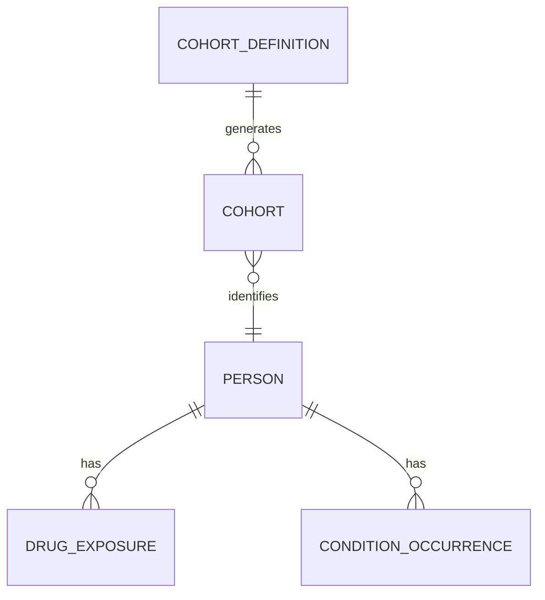

# Blog Post Prompt: ATLAS Cohort Definitions

## Context

This is a specific prompt for generating the Module 13 blog post about cohort definitions in ATLAS. This post is part of the "Learning OHDSI" series.

## Series Context (DO NOT mention module numbers in output)

**Previous topics covered:**
- OMOP CDM Introduction
- Standardized Vocabularies (SNOMED CT, RxNorm, LOINC)
- ETL Fundamentals
- Data Quality
- Characterization

**Current topic:** Cohort Definitions in ATLAS
**Next topic:** Population-Level Estimation (comparative effectiveness)

## Requirements

### 1. Verbose Background & Context

The introduction should:
- Reference previous posts thematically ("Building on our exploration of...")
- Explain what has been accomplished so far in the learning journey
- Explain the significance of cohorts in clinical research context
- Include OHDSI adoption metrics to demonstrate global importance

### 2. OHDSI Statistics to Include

Pull current statistics from OHDSI sources:
- Collaborators: 4,200+ across 83 countries
- Patient records: ~810 million (~12% of world population)
- Data sources: 453+ (EHRs, claims, registries)
- ATLAS GitHub: 294 stars, 50+ contributors
- EHDEN network: 100+ data partners in Europe
- DARWIN EU: EMA regulatory adoption

**Sources:**
- https://ohdsi.org/who-we-are
- https://github.com/OHDSI/Atlas
- https://ehden.eu
- PMC9742390

### 3. Why Cohorts Matter (Clinical Significance)

Explain:
- Cohorts are the operationalization of clinical questions
- Everything in observational research starts with "which patients?"
- Validity depends on precise population definition
- Portability enables global collaboration (write once, run anywhere)

Use quote from Book of OHDSI:
> "A cohort is not just a list of patients—it's the operationalization of a clinical question."

### 4. Disease Use Case: Type 2 Diabetes

Create a walkthrough using T2DM as the example:

**Clinical Scenario:**
Dr. Sarah Chen, an endocrinologist, wants to study cardiovascular outcomes in T2DM patients initiating metformin.

**Requirements:**
- Confirmed T2DM diagnosis (SNOMED CT: 201826)
- First-time metformin users (RxNorm: 6809)
- 365 days prior observation
- Exclude Type 1 DM and gestational diabetes

**Mapping Table:**
| Clinical Criterion | OMOP Domain | Vocabulary | Concept |
|-------------------|-------------|------------|---------|
| T2DM Diagnosis | Condition | SNOMED CT | 201826 |
| Metformin | Drug | RxNorm | 6809 |
| T1DM (exclude) | Condition | SNOMED CT | 201254 |

### 5. ATLAS Walkthrough with Screenshots

**Screenshots needed from demo.atlas.ohdsi.org:**
1. Home page
2. Cohort Definitions list
3. New Cohort creation screen
4. Entry Event configuration
5. Concept Set creation for T2DM
6. Inclusion Criteria panel
7. Exit Criteria configuration
8. Generation tab with results

**Use Playwright MCP or manual capture for screenshots.**

### 6. Backend Tables Explanation

Explain what happens when "Generate" is clicked:
- ATLAS translates visual definition to SQL
- SQL queries condition_occurrence, drug_exposure, observation_period
- Results stored in `cohort` table

**Show simplified SQL:**
```sql
INSERT INTO cohort (cohort_definition_id, subject_id, cohort_start_date, cohort_end_date)
SELECT @cohort_id, person_id, drug_exposure_start_date, drug_exposure_end_date
FROM drug_exposure
WHERE drug_concept_id IN (/* metformin */)
  AND person_id IN (SELECT person_id FROM condition_occurrence WHERE condition_concept_id IN (/* T2DM */))
  -- ... additional criteria
```

**Show ERD:**


### 7. Community Insights

Reference OHDSI Forums discussions:
- Phenotype Phebruary T2DM thread (forums.ohdsi.org)
- Common pitfalls in cohort design
- Best practices from experienced implementers

### 8. Common Pitfalls

| Pitfall | Why It Happens | Solution |
|---------|----------------|----------|
| Overly specific concept sets | Missing subtypes | Include descendants |
| No prior observation | Assuming data exists | Require minimum observation |
| Ignoring drug eras | Fragmented exposures | Use persistence windows |
| Including prevalent users | Not first occurrence | Require first-time users |

### 9. Key Takeaways

✅ Cohorts are algorithms, not just patient lists—reproducible across any OMOP CDM

✅ Three components: Entry event, inclusion criteria, exit criteria

✅ ATLAS generates SQL—understanding backend helps debugging

✅ Concept sets are building blocks—invest in creating comprehensive ones

✅ Always validate with cohort characterization before analysis

### 10. Bridge to Next Topic

Preview population-level estimation without saying "Module 14":

"With the ability to precisely define patient populations, we're ready to explore what comes next: using these cohorts to generate evidence. We'll take our T2DM cohort and ask: 'Among patients who initiate metformin, does adding an SGLT2 inhibitor reduce cardiovascular events compared to adding a sulfonylurea?'"

---

## Output Structure

```
blog-post/
├── atlas-cohort-definitions-clinical-populations.md  # Primary (Mermaid)
├── atlas-cohort-definitions-clinical-populations_ascii.md
├── visualizations/
│   └── screenshots/
│       ├── cohort_01_home.png
│       ├── cohort_02_list.png
│       ├── cohort_03_new.png
│       └── ... (8 total)
└── research-notes.md
```

---

## Playwright Screenshot Script (if using)

```javascript
const { chromium } = require('playwright');

async function captureATLASCohortWorkflow() {
  const browser = await chromium.launch();
  const page = await browser.newPage({ viewport: { width: 1920, height: 1080 } });

  // 1. Home
  await page.goto('https://demo.atlas.ohdsi.org');
  await page.waitForLoadState('networkidle');
  await page.screenshot({ path: 'cohort_01_home.png' });

  // 2. Cohort Definitions
  await page.click('a:has-text("Cohort Definitions")');
  await page.waitForLoadState('networkidle');
  await page.screenshot({ path: 'cohort_02_list.png' });

  // 3. New Cohort
  await page.click('button:has-text("New Cohort")');
  await page.waitForLoadState('networkidle');
  await page.screenshot({ path: 'cohort_03_new.png' });

  // Continue for remaining screens...

  await browser.close();
}

captureATLASCohortWorkflow();
```

---

## References for This Post

- Book of OHDSI Chapter 10: https://ohdsi.github.io/TheBookOfOhdsi/Cohorts.html
- OHDSI Cohort Tutorial 2022: https://www.ohdsi.org/wp-content/uploads/2022/10/Creating-Cohorts-Tutorial-2022.pdf
- OHDSI Forums T2DM Thread: https://forums.ohdsi.org/t/phenotype-phebruary-day-1-type-2-diabetes-mellitus/15764
- ATLAS Wiki: https://ohdsi.org/web/wiki/doku.php?id=documentation:software:atlas:cohorts
