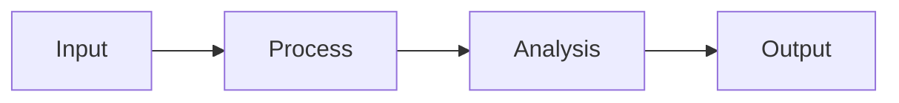
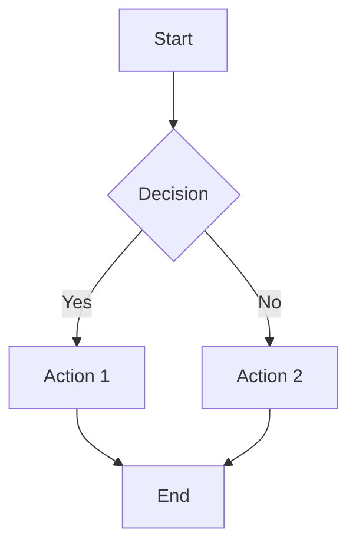

# Slide Generation Skill

## Purpose
Transform research content into professional presentation slide decks. Output in Marp-compatible markdown format that can be rendered to PDF/HTML and also works with reveal.js for interactive presentations.

## When to Activate
- User requests presentation slides
- Slide deck creation needed
- Conference/meeting presentation preparation
- Educational presentation material

**Key Triggers**: slides, presentation, deck, powerpoint, keynote, present, talk

## Prerequisites

### Marp CLI (for PDF/HTML export)
```bash
# Install Marp CLI
npm install -g @marp-team/marp-cli

# Verify installation
marp --version

# Convert markdown to PDF
marp slides.md -o slides.pdf

# Convert to HTML
marp slides.md -o slides.html

# Start presentation server
marp slides.md --server
```

## Slide Deck Template

### Marp-Compatible Format
```markdown
---
marp: true
theme: default
paginate: true
header: '[Topic] | Research Presentation'
footer: 'Generated by Research Hub'
style: |
  section {
    font-family: 'Segoe UI', Arial, sans-serif;
  }
  h1 {
    color: #2c3e50;
  }
  h2 {
    color: #34495e;
  }
  .columns {
    display: grid;
    grid-template-columns: 1fr 1fr;
    gap: 1rem;
  }
---

# [Presentation Title]
## [Subtitle]

**Presenter Name**
*Organization*

Date: YYYY-MM-DD

---

# Agenda

1. Introduction & Background
2. Key Concepts
3. Methodology
4. Results & Findings
5. Discussion
6. Conclusions & Next Steps
7. Q&A

---

# Introduction

## Background

- Context point 1
- Context point 2
- Context point 3

> "Key quote or statistic that frames the presentation"

---

# Key Concept 1

## Definition

[Clear, concise definition]

## Why It Matters

- Importance point 1
- Importance point 2


---

# Key Concept 2

<div class="columns">
<div>

## Traditional Approach
- Point 1
- Point 2
- Point 3

</div>
<div>

## New Approach
- Point 1
- Point 2
- Point 3

</div>
</div>

---

# Process Overview



---

# Key Findings

## Finding 1
[Description with supporting data]

## Finding 2
[Description with supporting data]

## Finding 3
[Description with supporting data]

---

# Data Visualization

| Metric | Before | After | Change |
|--------|--------|-------|--------|
| Metric 1 | 100 | 150 | +50% |
| Metric 2 | 80 | 95 | +19% |
| Metric 3 | 60 | 85 | +42% |

---

# Code Example

```sql
SELECT
    p.person_id,
    c.condition_concept_id,
    c.condition_start_date
FROM cdm.person p
JOIN cdm.condition_occurrence c
    ON p.person_id = c.person_id
WHERE c.condition_concept_id = 201826;
```

---

# Discussion

## Implications

1. **Implication 1**: Description
2. **Implication 2**: Description
3. **Implication 3**: Description

## Limitations

- Limitation 1
- Limitation 2

---

# Conclusions

## Key Takeaways

1. ✅ Takeaway 1
2. ✅ Takeaway 2
3. ✅ Takeaway 3

## Next Steps

- [ ] Action item 1
- [ ] Action item 2
- [ ] Action item 3

---

# Resources

- 📖 **Documentation**: [link]
- 💻 **Code Repository**: [link]
- 📧 **Contact**: email@example.com

---

# Questions?

## Thank You!

**Contact Information**
- Email: presenter@org.com
- Twitter: @handle
- GitHub: github.com/user


---

<!-- Speaker Notes Section -->
<!--
_class: notes

## Speaker Notes for Slide 3

Key points to emphasize:
- Background context is crucial
- Mention the specific problem we're solving
- Engage audience with the statistic

Timing: ~2 minutes
-->
```

## Slide Design Guidelines

### Content Per Slide
| Element | Maximum | Recommendation |
|---------|---------|----------------|
| Title | 1 | Clear, descriptive |
| Bullet points | 5-7 | 4-5 optimal |
| Words per bullet | 10-12 | Shorter is better |
| Images | 1-2 | High quality, relevant |
| Code blocks | 1 | 10-15 lines max |

### Slide Types
```
1. Title Slide - Opening with title, presenter, date
2. Agenda Slide - Overview of presentation structure
3. Content Slide - Main information with bullets
4. Visual Slide - Diagrams, charts, images
5. Code Slide - Syntax-highlighted code
6. Table Slide - Data in tabular format
7. Quote Slide - Impactful quotes
8. Two-Column Slide - Side-by-side comparison
9. Conclusion Slide - Key takeaways
10. Q&A Slide - Closing with contact info
```

## Marp Directives

### Global Directives (in frontmatter)
```yaml
---
marp: true
theme: default        # default, gaia, uncover
paginate: true        # Show page numbers
header: 'Header text'
footer: 'Footer text'
backgroundColor: white
backgroundImage: url('bg.png')
---
```

### Local Directives (per slide)
```markdown
<!-- _class: lead -->      # Large centered title
<!-- _class: invert -->    # Dark theme
<!-- _paginate: false -->  # Hide page number
<!-- _header: '' -->       # Remove header
<!-- _footer: '' -->       # Remove footer
<!-- _backgroundColor: #123456 -->
```

### Image Positioning
```markdown
           # Full background
      # Left half background
 # Right 40% background
   # Fit without crop
       # Same as contain
  # Inline with width
```

## reveal.js Compatibility

### Dual-Format Slides
```markdown
---
marp: true
---

<!-- Also compatible with reveal.js when saved as .html -->

# Slide Title

Content here works in both Marp and reveal.js

---

# Next Slide

More content

---
```

### reveal.js Specific Features
```html
<!-- For reveal.js only features, use HTML comments -->

<section data-transition="slide">
  <h1>Animated Slide</h1>
</section>

<section>
  <h2>Fragments</h2>
  <p class="fragment">Appears first</p>
  <p class="fragment">Appears second</p>
</section>
```

## Generation Process

### Step 1: Content Outline
```python
def create_slide_outline(content: str) -> list:
    """Create presentation outline from content."""
    return [
        {'type': 'title', 'title': '', 'subtitle': ''},
        {'type': 'agenda', 'items': []},
        {'type': 'content', 'title': '', 'bullets': []},
        # ...
    ]
```

### Step 2: Slide Generation
```python
def generate_slide(slide_data: dict) -> str:
    """Generate markdown for a single slide."""
    if slide_data['type'] == 'title':
        return f"""
# {slide_data['title']}
## {slide_data['subtitle']}

---
"""
    elif slide_data['type'] == 'content':
        bullets = '\n'.join([f"- {b}" for b in slide_data['bullets']])
        return f"""
# {slide_data['title']}

{bullets}

---
"""
```

### Step 3: Export Options
```bash
# Export to PDF
marp slides.md -o slides.pdf

# Export to HTML (standalone)
marp slides.md -o slides.html

# Export to PPTX
marp slides.md -o slides.pptx

# Watch mode for development
marp -w slides.md

# Presentation server
marp -s slides.md
```

## Presentation Length Guidelines

| Duration | Slides | Content Depth |
|----------|--------|---------------|
| 5 min | 5-8 | Key points only |
| 15 min | 12-18 | Standard presentation |
| 30 min | 25-35 | Detailed coverage |
| 45 min | 35-50 | Comprehensive |
| 60 min | 45-60 | Full workshop |

## Visual Elements

### Mermaid Diagrams
```markdown
# Process Flow


```

### Tables
```markdown
| Column 1 | Column 2 | Column 3 |
|----------|----------|----------|
| Data 1   | Data 2   | Data 3   |
| Data 4   | Data 5   | Data 6   |
```

### Code Blocks
```markdown
```python
def example():
    return "Hello, World!"
```
```

## Output Structure

```
output/slides/[topic]/
├── [topic]_slides.md          # Marp source
├── [topic]_slides.pdf         # PDF export
├── [topic]_slides.html        # HTML export
├── [topic]_slides_notes.md    # Speaker notes
├── images/                     # Slide images
│   ├── diagram1.png
│   └── diagram2.svg
└── assets/                     # Additional assets
    └── custom.css
```

## Best Practices

1. **One Idea Per Slide**: Keep focus clear
2. **Visual Balance**: Don't overcrowd
3. **Consistent Style**: Use same fonts, colors
4. **High Contrast**: Ensure readability
5. **Progressive Disclosure**: Build complexity gradually
6. **Speaker Notes**: Include detailed notes
7. **Practice Timing**: ~1-2 minutes per slide

## Integration

### Command Usage
```
/notebooklm-generate-slides [topic_or_path]
```

### With Other Artifacts
- **Mindmaps**: Slides visualize mindmap structure
- **Reports**: Slides summarize key report points
- **Podcasts**: Slides accompany podcast content

## See Also
- Command: /notebooklm-generate-slides
- Skill: mindmap-creation
- Workflow: notebooklm-complete-workflow.md
