# Mermaid Generation Patterns

## Direction Selection

```
TB (Top-Bottom): Hierarchies, architectures, org charts
LR (Left-Right): Pipelines, processes, timelines
BT (Bottom-Top): Build-up diagrams, dependencies
RL (Right-Left): Reverse flows, rollback processes
```

## Dynamic Structure Generation

### From Extracted Entities
```
Input Analysis:
- categories: [{title, items}, ...]
- relationships: [parent→child, ...]
- flow_type: "hierarchy" | "pipeline" | "radial"

Output:
- flowchart direction
- node definitions
- subgraph groupings
- connection arrows
- style classes
```

### Node ID Generation
```javascript
// Create safe IDs from titles
function toNodeId(title, index) {
  return title
    .replace(/[^a-zA-Z0-9]/g, '')
    .substring(0, 10)
    .toUpperCase() + index;
}

// Examples:
"Data Sources" → "DATASOURCE0"
"NLP Models" → "NLPMODELS1"
```

## Building Blocks

### Central Node
```mermaid
CDM["{icon} <b>{title}</b><br/>{description}"]
```

### Subgraph (Category)
```mermaid
subgraph {NODE_ID}["{icon} {title}"]
    direction TB
    {ITEMS}
end
```

### Item Node
```mermaid
{ITEM_ID}["{name}<br/><i>{description}</i>"]
```

### Connections
```mermaid
%% From central to categories
CDM --> CAT1
CDM --> CAT2

%% Pipeline style
A --> B --> C --> D

%% With labels
A -->|"transforms"| B
```

## Style Class Generator

### Base Classes
```mermaid
classDef core fill:#6366f1,stroke:#4f46e5,color:#fff,stroke-width:3px
classDef default fill:#f8fafc,stroke:#e2e8f0,color:#1e293b
```

### Category Classes (generate per category)
```mermaid
classDef {catId}Box fill:{bgColor},stroke:{borderColor},stroke-width:2px
classDef {catId}Item fill:#fff,stroke:{borderColor},color:{textColor}
```

### Color Assignment
```javascript
const colorSets = [
  {bg: '#d1fae5', border: '#059669', text: '#065f46'}, // Green
  {bg: '#cffafe', border: '#0891b2', text: '#155e75'}, // Cyan
  {bg: '#fef3c7', border: '#d97706', text: '#92400e'}, // Amber
  {bg: '#ede9fe', border: '#7c3aed', text: '#5b21b6'}, // Purple
  {bg: '#fee2e2', border: '#dc2626', text: '#991b1b'}, // Red
];

function getColorSet(index) {
  return colorSets[index % colorSets.length];
}
```

## Layout Patterns

### Architecture (TB with subgraphs)

```mermaid
flowchart TB
    CDM["🏛️ <b>Central System</b><br/>Description"]
    
    CDM --> CAT1
    CDM --> CAT2
    CDM --> CAT3
    
    subgraph CAT1["📊 Category 1"]
        C1A["Item A<br/><i>desc</i>"]
        C1B["Item B<br/><i>desc</i>"]
    end
    
    subgraph CAT2["📚 Category 2"]
        C2A["Item A<br/><i>desc</i>"]
    end
    
    subgraph CAT3["🔧 Category 3"]
        C3A["Item A<br/><i>desc</i>"]
    end
```


### Pipeline (LR linear)

```mermaid
flowchart LR
    A["📥 Input<br/><i>Raw Data</i>"] 
    --> B["⚙️ Process<br/><i>Transform</i>"]
    --> C["🧠 Model<br/><i>Analyze</i>"]
    --> D["📤 Output<br/><i>Results</i>"]
```


### Pipeline with Parallel Steps


### Decision Tree


### Hierarchy (Multiple Levels)


## HTML Wrapper Generation

```html
<!DOCTYPE html>
<html lang="en">
<head>
    <meta charset="UTF-8">
    <meta name="viewport" content="width=device-width, initial-scale=1.0">
    <title>{TITLE}</title>
    <script src="https://cdnjs.cloudflare.com/ajax/libs/mermaid/10.6.1/mermaid.min.js"></script>
    <style>
        * { margin: 0; padding: 0; box-sizing: border-box; }
        body {
            font-family: 'Segoe UI', system-ui, sans-serif;
            background: {BACKGROUND};
            min-height: 100vh;
            padding: 40px 20px;
        }
        .container { max-width: {MAX_WIDTH}px; margin: 0 auto; }
        .header { text-align: center; margin-bottom: 40px; }
        .header h1 { color: {TITLE_COLOR}; font-size: 2.5rem; font-weight: 600; margin-bottom: 10px; }
        .header p { color: {SUBTITLE_COLOR}; font-size: 1.1rem; }
        .diagram-container {
            background: #fff;
            border-radius: 16px;
            padding: 40px;
            box-shadow: 0 25px 50px -12px rgba(0, 0, 0, 0.5);
            overflow-x: auto;
        }
        .mermaid { display: flex; justify-content: center; }
        .download-btn {
            display: block;
            margin: 30px auto 0;
            padding: 14px 32px;
            background: linear-gradient(135deg, #667eea 0%, #764ba2 100%);
            color: white;
            border: none;
            border-radius: 8px;
            font-size: 1rem;
            font-weight: 600;
            cursor: pointer;
        }
        .footer { text-align: center; margin-top: 30px; color: {FOOTER_COLOR}; font-size: 0.9rem; }
    </style>
</head>
<body>
    <div class="container">
        <div class="header">
            <h1>{TITLE}</h1>
            <p>{SUBTITLE}</p>
        </div>
        <div class="diagram-container">
            <div class="mermaid">
{MERMAID_CODE}
            </div>
        </div>
        <button class="download-btn" onclick="downloadSVG()">⬇️ Download as SVG</button>
        <div class="footer"><p>{FOOTER}</p></div>
    </div>
    <script>
        mermaid.initialize({ 
            startOnLoad: true,
            theme: 'base',
            themeVariables: {
                fontFamily: 'Segoe UI, system-ui, sans-serif',
                fontSize: '13px',
                primaryColor: '#6366f1',
                primaryTextColor: '#1e293b',
                lineColor: '#6366f1'
            },
            flowchart: {
                htmlLabels: true,
                curve: 'basis',
                nodeSpacing: {NODE_SPACING},
                rankSpacing: {RANK_SPACING},
                padding: 15,
                useMaxWidth: true
            }
        });
        function downloadSVG() {
            const svg = document.querySelector('.mermaid svg');
            const svgData = new XMLSerializer().serializeToString(svg);
            const blob = new Blob([svgData], {type: 'image/svg+xml'});
            const url = URL.createObjectURL(blob);
            const a = document.createElement('a');
            a.href = url;
            a.download = '{FILENAME}.svg';
            a.click();
        }
    </script>
</body>
</html>
```

### Theme Variables
```javascript
// Dark theme
BACKGROUND: "linear-gradient(135deg, #1a1a2e 0%, #16213e 100%)"
TITLE_COLOR: "#fff"
SUBTITLE_COLOR: "#8892b0"
FOOTER_COLOR: "#8892b0"
MAX_WIDTH: 1100

// Light theme
BACKGROUND: "#f8fafc"
TITLE_COLOR: "#1e293b"
SUBTITLE_COLOR: "#64748b"
FOOTER_COLOR: "#64748b"
MAX_WIDTH: 1100
```

### Spacing Calculator
```javascript
// Based on content complexity
function calculateSpacing(numCategories, maxItemsPerCategory) {
  const nodeSpacing = Math.max(20, 50 - (numCategories * 5));
  const rankSpacing = Math.max(40, 70 - (maxItemsPerCategory * 5));
  return { nodeSpacing, rankSpacing };
}
```

## Complete Generation Algorithm

```python
def generate_mermaid(analyzed_content):
    direction = select_direction(analyzed_content.flow_type)
    
    lines = [f"flowchart {direction}"]
    
    # Central node
    if analyzed_content.central_node:
        lines.append(f'    CDM["{analyzed_content.central_icon} <b>{analyzed_content.central_title}</b><br/>{analyzed_content.central_desc}"]')
        lines.append("")
    
    # Connections from central
    for i, cat in enumerate(analyzed_content.categories):
        lines.append(f"    CDM --> CAT{i}")
    lines.append("")
    
    # Subgraphs for each category
    for i, cat in enumerate(analyzed_content.categories):
        lines.append(f'    subgraph CAT{i}["{cat.icon} {cat.title}"]')
        for j, item in enumerate(cat.items):
            item_id = f"C{i}I{j}"
            lines.append(f'        {item_id}["{item.name}<br/><i>{item.desc}</i>"]')
        lines.append("    end")
        lines.append("")
    
    # Style classes
    lines.append("    classDef core fill:#6366f1,stroke:#4f46e5,color:#fff,stroke-width:3px")
    for i, cat in enumerate(analyzed_content.categories):
        colors = get_color_set(i)
        lines.append(f"    classDef cat{i}Box fill:{colors.bg},stroke:{colors.border},stroke-width:2px")
    lines.append("")
    
    # Apply classes
    lines.append("    class CDM core")
    for i in range(len(analyzed_content.categories)):
        lines.append(f"    class CAT{i} cat{i}Box")
    
    return "\n".join(lines)
```
