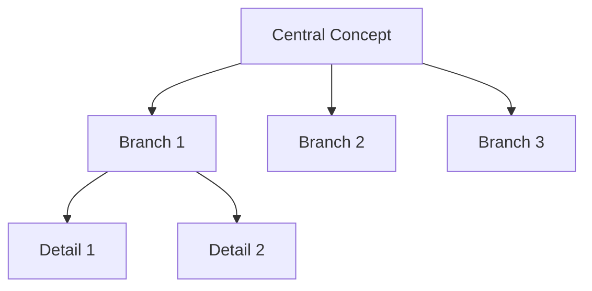

# Mind Map Creation Standards for Research Hub Profile

This document defines standards and best practices for creating effective mind maps that enhance understanding, learning, and knowledge retention.

## Core Principles

### 1. Visual Clarity
Mind maps must be easy to scan and understand at a glance
- Clear hierarchical structure
- Consistent formatting
- Adequate white space
- Logical flow

### 2. Cognitive Alignment
Structure should match how people think about the topic
- Central concept prominence
- Logical grouping
- Natural relationships
- Progressive complexity

### 3. Completeness
Cover all essential aspects without overwhelming
- All key concepts included
- Appropriate level of detail
- Balanced branches
- No critical gaps

### 4. Actionability
Support learning and application
- Learning paths clear
- Relationships explicit
- Applications identified
- Next steps suggested

## Mind Map Types and When to Use Them

### 1. Concept Mind Map
**Purpose**: Understand structure and relationships of a topic

**Use When**:
- Learning a new subject
- Organizing knowledge domain
- Understanding relationships
- Building mental models

**Structure**:
```markdown
# [CENTRAL CONCEPT]

## Branch 1: [Category]
├── Subconcept 1.1
│   ├── Detail A
│   └── Detail B
├── Subconcept 1.2
└── Subconcept 1.3

## Branch 2: [Category]
└── ...

## Relationships
- [A] → [B]
- [C] ↔ [D]
```

### 2. Process Mind Map
**Purpose**: Visualize workflows, procedures, sequences

**Use When**:
- Documenting processes
- Planning implementation
- Understanding workflows
- Identifying dependencies

**Structure**:
```markdown
# PROCESS: [Name]

## Phase 1
START → Step 1.1 → Step 1.2
        ↓
        Decision Point
        ↓ Yes    ↓ No
     Step 1.3  Alt Path

## Phase 2
[Continue...]
```

### 3. Domain Map
**Purpose**: Comprehensive overview of a field

**Use When**:
- Curriculum design
- Field orientation
- Comprehensive learning
- Knowledge audit

**Structure**:
```markdown
# DOMAIN: [Field]

## Foundations
└── Core concepts

## Methods
└── Approaches

## Applications
└── Use cases

## Tools
└── Technologies

## Learning Path
└── Progression
```

### 4. Problem-Solution Map
**Purpose**: Analyze problems and explore solutions

**Use When**:
- Troubleshooting
- Strategic planning
- Root cause analysis
- Decision making

**Structure**:
```markdown
# PROBLEM: [Issue]

## Root Causes
├── Cause 1
└── Cause 2

## Effects
├── Effect 1
└── Effect 2

## Solutions
├── Strategy 1
│   └── Implementation
└── Strategy 2
```

### 5. Comparative Mind Map
**Purpose**: Compare and contrast concepts

**Use When**:
- Evaluating options
- Understanding differences
- Making decisions
- Learning distinctions

**Structure**:
```markdown
# COMPARISON: [A] vs [B]

## Similarities
└── Shared aspects

## A Characteristics
├── Feature 1
└── Pros/Cons

## B Characteristics
├── Feature 1
└── Pros/Cons

## Decision Matrix
└── When to use each
```

## Structural Standards

### Branching Guidelines

#### Number of Main Branches
- **Minimum**: 3 branches
- **Optimal**: 4-7 branches
- **Maximum**: 9 branches

Too few branches = insufficient organization
Too many branches = cognitive overload

#### Depth Guidelines
- **Level 1**: Central concept (1)
- **Level 2**: Main branches (3-7)
- **Level 3**: Subconcepts (2-5 per branch)
- **Level 4**: Details (2-4 per subconcept)
- **Level 5+**: Avoid if possible

**Rule**: 3-4 levels is ideal. Beyond 4 levels, consider creating separate mind maps.

#### Branch Balance
- Aim for roughly equal complexity across branches
- If one branch is much larger, consider splitting it
- Balance doesn't mean identical - just comparable

### Hierarchical Structure

#### Parent-Child Relationships
- Each child should logically belong to its parent
- Children at same level should be comparable in scope
- Use parallel structure (all nouns, all verbs, etc.)

**Good Example**:
```markdown
## Machine Learning
├── Supervised Learning
├── Unsupervised Learning
└── Reinforcement Learning
```

**Bad Example**:
```markdown
## Machine Learning
├── Neural Networks (too specific)
├── How to train models (different structure)
└── Applications (different category)
```

### Naming Conventions

#### Central Concept
- Clear, concise (1-5 words)
- Noun or noun phrase
- Specific enough to be meaningful
- Broad enough to encompass all branches

#### Branch Names
- Descriptive (2-5 words)
- Parallel structure across branches
- Capitalize main words
- No punctuation unless necessary

#### Node Labels
- Concise (1-3 words when possible)
- Clear and specific
- Use standard terminology
- Define abbreviations

## Formatting Standards

### Standard Template

```markdown
---
title: Mind Map - [Topic]
type: Mind Map
topic: [Main Topic]
domain: [AI/Clinical/Technical/Mixed]
complexity: [Basic/Intermediate/Advanced]
created: [YYYY-MM-DD]
version: 1.0
---

# [CENTRAL CONCEPT]

## Mind Map Overview
- **Purpose**: [What this clarifies]
- **Target Audience**: [Who benefits]
- **Key Insight**: [Main understanding]

## Structure

### Branch 1: [Category]
├── Subconcept 1
│   ├── Detail A - [brief explanation]
│   └── Detail B - [brief explanation]
└── Subconcept 2

[Continue for all branches...]

## Relationships & Connections

### Direct Dependencies
- [A] **requires** [B]
- [C] **builds upon** [D]

### Influences
- [X] **affects** [Y]
- [M] **correlates with** [N]

### Sequential
- [Step 1] **leads to** [Step 2]

## Learning Path

**Beginner**:
1. Start with [concept]
2. Then [concept]

**Intermediate**:
1. Explore [concept]

**Advanced**:
1. Master [concept]

## Key Takeaways
1. [Insight 1]
2. [Insight 2]
3. [Insight 3]

## Related Topics
- [Related mind map 1]
- [Related mind map 2]

## Legend
[Explain any symbols or conventions used]
```

### Visual Formatting

#### Tree Structure Symbols
```markdown
├── Branch continues
└── Last branch
│   Vertical connector
─── Horizontal connector
```

#### Relationship Symbols
```markdown
→   Direct relationship / leads to
←   Comes from
↔   Bidirectional
⇒   Strong influence / implies
⇄   Mutual influence
```

#### Emphasis Symbols
```markdown
Main concept
Core concept
✓ Key point
⚠️ Important consideration
💡 Insight / tip
Critical
📚 Reference / further reading
```

### Color and Emphasis

While markdown doesn't support color, use these conventions:

#### Emphasis Levels
```markdown
# ALL CAPS for central concept
## Title Case for main branches
### Sentence case for subconcepts
normal case for details
```

#### Highlighting Important Items
```markdown
**Bold** for key concepts
*Italic* for technical terms
`Code` for technical identifiers
> Quote blocks for important notes
```

## Content Standards

### Information Density

#### Per Node
- **Ideal**: 1-5 words per node label
- **Maximum**: 10 words per node label
- **With explanation**: Add brief note after dash

**Example**:
```markdown
├── Transformer Architecture - encoder-decoder with attention
```

#### Per Branch
- **Minimum**: 2 nodes per branch
- **Optimal**: 3-7 nodes per branch
- **Maximum**: 10 nodes per branch

If more needed, create sub-branches or separate mind map.

### Relationship Documentation

#### When to Show Relationships
- Dependencies between concepts
- Sequential flows
- Causal relationships
- Complementary concepts
- Contrasting ideas

#### Relationship Types
1. **Hierarchical**: Implicit in tree structure
2. **Sequential**: Use arrows (→)
3. **Dependency**: Use "requires", "needs"
4. **Influence**: Use "affects", "impacts"
5. **Equivalence**: Use "same as", "similar to"

#### Documentation Format
```markdown
## Relationships & Connections

### [Category of Relationship]
- [Concept A] **[relationship verb]** [Concept B]
  - Explanation: [Why this relationship matters]
```

### Learning Paths

Every mind map should include a suggested learning path:

#### Structure
1. **Beginner Level**: Starting concepts
2. **Intermediate Level**: Building on basics
3. **Advanced Level**: Complex topics

#### Guidelines
- Start with fundamentals
- Build progressively
- Show prerequisites clearly
- Suggest time estimates if relevant

#### Example
```markdown
## Learning Path

**Phase 1: Foundations** (Week 1-2)
1. Start with [Core Concept A]
2. Understand [Core Concept B]
3. Practice [Basic Application]

**Phase 2: Building** (Week 3-4)
1. Explore [Intermediate Topic]
2. Apply to [Use Case]

**Phase 3: Advanced** (Week 5+)
1. Master [Advanced Topic]
2. Integrate concepts
```

## Quality Standards

### Completeness Checklist

- [ ] Central concept clearly identified
- [ ] 3-7 main branches defined
- [ ] Each branch has 2+ subconcepts
- [ ] Depth is 3-4 levels (not too shallow or deep)
- [ ] All key aspects of topic covered
- [ ] No major gaps in coverage
- [ ] No redundancy or overlap between branches

### Clarity Checklist

- [ ] Hierarchical structure is logical
- [ ] Node labels are clear and concise
- [ ] Parallel structure used within levels
- [ ] Formatting is consistent
- [ ] Visual hierarchy is apparent
- [ ] Can be scanned quickly
- [ ] Relationships are explicit

### Usability Checklist

- [ ] Purpose is stated
- [ ] Target audience identified
- [ ] Overview provided
- [ ] Learning path included
- [ ] Key takeaways listed
- [ ] Related topics linked
- [ ] Legend included (if using symbols)

### Accuracy Checklist

- [ ] All concepts correctly represented
- [ ] Relationships are accurate
- [ ] Hierarchy reflects actual structure
- [ ] No misleading simplifications
- [ ] Technical terms used correctly
- [ ] Sources cited if based on specific content

## Domain-Specific Standards

### AI/Technical Mind Maps

#### Requirements
- Technical accuracy paramount
- Standard terminology used
- Framework versions noted if relevant
- Common algorithms/methods included
- Practical applications shown

#### Best Practices
- Show mathematical relationships when relevant
- Include performance characteristics
- Note computational requirements
- Link to implementations/code
- Show evolution of techniques

#### Example Structure
```markdown
# DEEP LEARNING

## Architectures
├── Feedforward Networks
├── Convolutional Networks
├── Recurrent Networks
└── Transformers

## Training Methods
├── Optimization Algorithms
├── Regularization Techniques
└── Hyperparameter Tuning

## Applications
├── Computer Vision
├── Natural Language Processing
└── Speech Recognition
```

### Clinical Mind Maps

#### Requirements
- Medical accuracy essential
- Standard medical terminology
- Evidence-based relationships
- Safety considerations highlighted
- Regulatory compliance noted

#### Best Practices
- Patient-centered perspective
- Clinical workflow integration
- Decision criteria explicit
- Care team roles shown
- Documentation requirements noted

#### Example Structure
```markdown
# PATIENT CARE PATHWAY: Hypertension

## Assessment
├── History Taking
├── Physical Examination
└── Diagnostic Testing

## Risk Stratification
├── Low Risk
├── Moderate Risk
└── High Risk

## Treatment
├── Lifestyle Modifications
├── First-Line Medications
└── Combination Therapy

## Monitoring
├── Follow-up Schedule
├── Lab Monitoring
└── Outcome Assessment
```

## Special Features

### Interactive Elements

#### Expandable Sections
For complex topics, create overview and detailed versions:

```markdown
# Topic (Overview)
## Branch 1
└── [See detailed mind map: branch-1-detailed.md]

## Branch 2
└── [See detailed mind map: branch-2-detailed.md]
```

#### Cross-References
Link related mind maps:

```markdown
## Related Mind Maps
- [Prerequisite: Basic Concepts](../basic-concepts-mindmap.md)
- [Related: Advanced Techniques](../advanced-techniques-mindmap.md)
- [Application: Use Case Study](../use-case-mindmap.md)
```

### Alternative Formats

#### Mermaid Diagrams
For tool-based visualization:

````markdown
## Visual Diagram


````

#### ASCII Art
For quick reference:

```markdown
## Quick Reference

           Central Concept
          /       |        \
         /        |         \
    Branch1    Branch2    Branch3
     / \         |          |
    /   \        |          |
  Sub1 Sub2    Sub3       Sub4
```

#### Outline Format
For linear reading:

```markdown
## Outline View

1. Central Concept
   1.1. Branch 1
       1.1.1. Subconcept A
       1.1.2. Subconcept B
   1.2. Branch 2
       1.2.1. Subconcept C
```

## Review and Iteration

### Self-Review Questions

Before finalizing, ask:

1. **Completeness**: Does this cover all key aspects?
2. **Clarity**: Can someone unfamiliar scan and understand?
3. **Accuracy**: Are all relationships correct?
4. **Balance**: Are branches roughly comparable?
5. **Depth**: Is it too shallow or too deep?
6. **Utility**: Will this help someone learn/understand?

### User Testing

If possible, test with:
- Someone unfamiliar with the topic (test clarity)
- Domain expert (test accuracy)
- Target user (test utility)

### Iteration Guidelines

Mind maps should evolve:

1. **Version 1.0**: Initial complete version
2. **Version 1.x**: Refinements and corrections
3. **Version 2.0**: Major restructuring if needed

Keep previous versions for reference.

## Common Pitfalls

### Avoid These Mistakes

❌ **Too Many Branches** (>9)
- Splits attention
- Harder to remember
- Solution: Group related items

❌ **Too Deep** (>5 levels)
- Hard to navigate
- Loses context
- Solution: Create separate mind maps

❌ **Inconsistent Structure**
- Confusing hierarchy
- Mixed concepts
- Solution: Use parallel structure

❌ **Missing Relationships**
- Appears disconnected
- Misses insights
- Solution: Explicitly show connections

❌ **Vague Labels**
- Unclear meaning
- Requires guessing
- Solution: Be specific and clear

❌ **Information Overload**
- Too much text per node
- Overwhelming
- Solution: Keep nodes concise, add explanation separately

❌ **No Learning Path**
- Unclear where to start
- Misses pedagogical value
- Solution: Always include learning progression

## Examples

### Example 1: Simple Concept Map

```markdown
---
title: Mind Map - Machine Learning Basics
complexity: Beginner
---

# MACHINE LEARNING

## Mind Map Overview
- **Purpose**: Understand the main branches of machine learning
- **Target Audience**: Beginners
- **Key Insight**: ML has three main paradigms

## Structure

### Supervised Learning
├── Classification - predict categories
│   ├── Binary (2 classes)
│   └── Multi-class (>2 classes)
└── Regression - predict continuous values

### Unsupervised Learning
├── Clustering - group similar data
└── Dimensionality Reduction - reduce features

### Reinforcement Learning
├── Agent - makes decisions
├── Environment - provides feedback
└── Reward - guides learning

## Relationships
- Supervised **requires** labeled data
- Unsupervised works with unlabeled data
- Reinforcement **learns through** interaction

## Learning Path
1. Start with Supervised (most intuitive)
2. Then Unsupervised (pattern finding)
3. Finally Reinforcement (sequential decisions)

## Key Takeaways
1. Three main ML paradigms serve different purposes
2. Choice depends on available data and problem type
3. Each has distinct algorithms and use cases
```

## Tools and Resources

### Recommended Tools
- **Markdown editors**: VS Code, Obsidian, Typora
- **Diagram tools**: Mermaid, draw.io
- **Mind map software**: MindNode, XMind (for complex maps)

### Learning Resources
- Cognitive psychology of learning
- Information architecture principles
- Visual communication design
- Knowledge management systems

## Continuous Improvement

These standards evolve. Update when:
- Better visualization methods discovered
- User feedback indicates issues
- New patterns emerge
- Domain needs change

Suggest improvements to profile maintainers.
