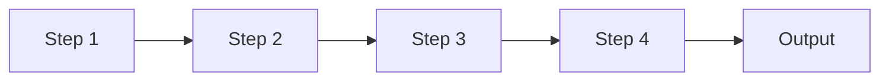
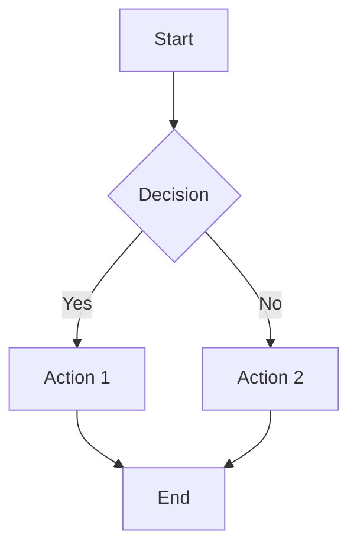

# [Presentation Title]
## [Subtitle]

**Presenter Name**
*Organization*

Date: [YYYY-MM-DD]

---

# Agenda

1. Introduction & Background
2. Key Concepts
3. [Section 3]
4. [Section 4]
5. Conclusions & Next Steps
6. Q&A

---

# Introduction

## Background

- [Context point 1]
- [Context point 2]
- [Context point 3]

> "[Impactful quote or statistic]"

---

# Why This Matters

## The Problem

- [Challenge 1]
- [Challenge 2]
- [Challenge 3]

## The Opportunity

- [Opportunity 1]
- [Opportunity 2]

---

# Key Concept 1

## Definition

[Clear, concise definition of the concept]

## Key Points

- [Point 1]
- [Point 2]
- [Point 3]


---

# Key Concept 2

<div class="columns">
<div>

## Traditional Approach

- [Point 1]
- [Point 2]
- [Point 3]

</div>
<div>

## New Approach

- [Point 1]
- [Point 2]
- [Point 3]

</div>
</div>

---

# Process Overview



---

# Detailed Process

## Step 1: [Step Name]

- [Sub-point 1]
- [Sub-point 2]

## Step 2: [Step Name]

- [Sub-point 1]
- [Sub-point 2]

---

# Data & Results

| Metric | Before | After | Change |
|--------|--------|-------|--------|
| [Metric 1] | [Value] | [Value] | [%] |
| [Metric 2] | [Value] | [Value] | [%] |
| [Metric 3] | [Value] | [Value] | [%] |

---

# Key Findings

## Finding 1

[Description with supporting evidence]

## Finding 2

[Description with supporting evidence]

## Finding 3

[Description with supporting evidence]

---

# Code Example

```sql
SELECT
    column1,
    column2,
    COUNT(*) as count
FROM table_name
WHERE condition = 'value'
GROUP BY column1, column2;
```

---

# Visual Representation



---

# Discussion

## Implications

1. [Implication 1]
2. [Implication 2]
3. [Implication 3]

## Limitations

- [Limitation 1]
- [Limitation 2]

---

# Conclusions

## Key Takeaways

1. ✅ [Takeaway 1]
2. ✅ [Takeaway 2]
3. ✅ [Takeaway 3]

---

# Next Steps

## Immediate Actions

- [ ] [Action 1]
- [ ] [Action 2]

## Future Work

- [ ] [Future item 1]
- [ ] [Future item 2]

---

# Resources

- 📖 **Documentation**: [link]
- 💻 **Code Repository**: [link]
- 📧 **Contact**: [email]
- 🔗 **Related Links**: [links]

---

# Questions?

## Thank You!

**Contact Information**
- Email: [email@example.com]
- Website: [website.com]
- Twitter: [@handle]


---

<!-- Speaker Notes Section -->

<!--
_class: notes

## Speaker Notes

### Slide 1 (Title)
- Welcome audience
- Brief self-introduction
- Set expectations

### Slide 2 (Agenda)
- Overview of what will be covered
- Mention timing (~X minutes)

### Slide 3 (Introduction)
- Provide context
- Why this topic matters now

[Continue with notes for each slide...]
-->
