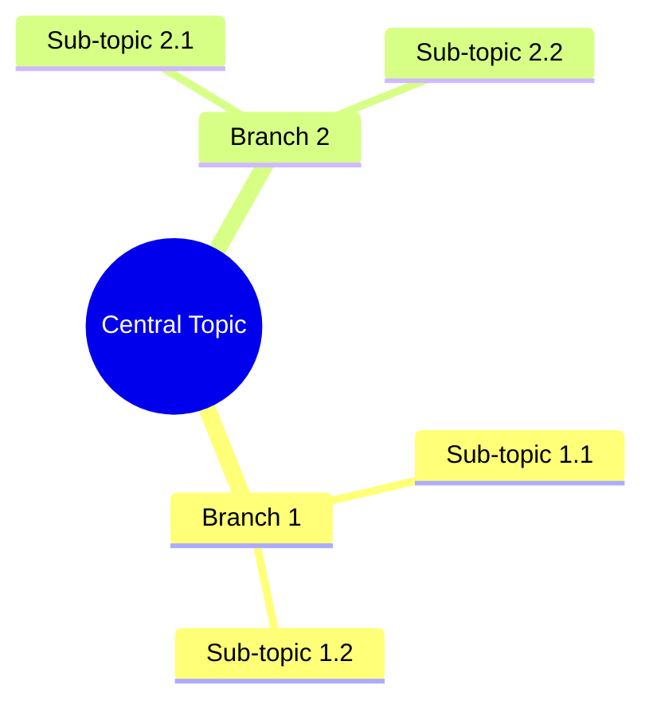
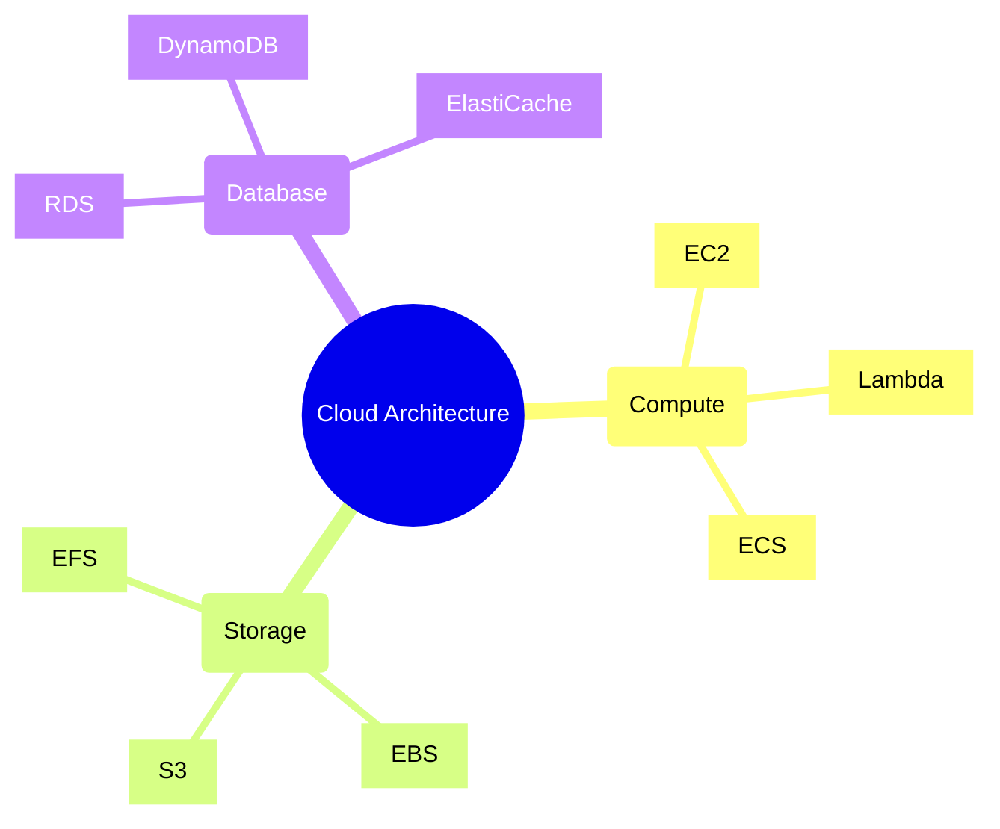
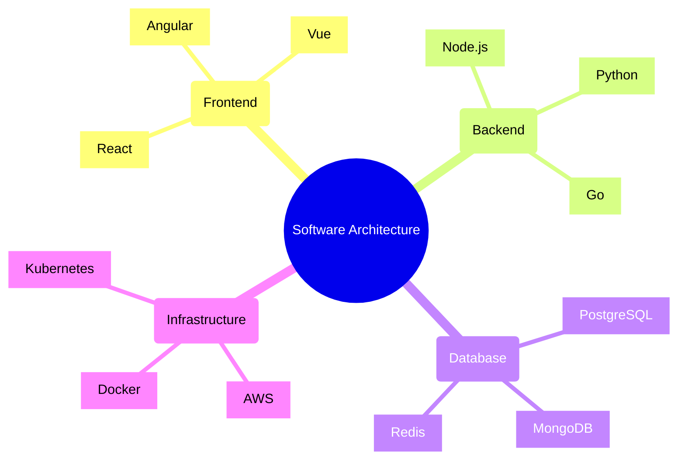
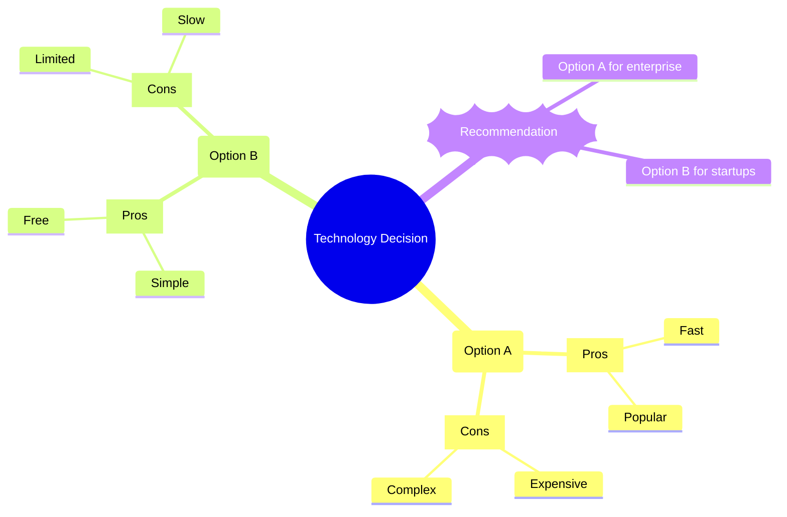

# Mind Mapping Workflow
## A Complete Guide to Visual Knowledge Representation

---

> **Document Info**
> | Field | Value |
> |-------|-------|
> | Type | Knowledge Visualization |
> | Domain | Concept Mapping & Analysis |
> | Category | Visual Thinking Tools |
> | Version | 1.0.0 |
> | Created | 2025-11-30 |

---

## Overview

This document provides a comprehensive explanation of the **Mind Mapping Workflow** for creating visual representations of complex topics, relationships, and hierarchies using Claude Code's research-hub profile.

| Aspect | Details |
|--------|---------|
| **Primary Purpose** | Transform complex information into visual diagrams |
| **Output Format** | Mermaid mindmap syntax (`.md` files) |
| **Key Benefits** | Improved comprehension, knowledge retention, communication |

---

## Table of Contents

| # | Section | Description |
|---|---------|-------------|
| 1 | [Mind Map Scenario](#1-mind-map-scenario) | Real-world mapping journey |
| 2 | [Fundamentals](#2-fundamentals) | Core concepts and principles |
| 3 | [Mermaid Syntax](#3-mermaid-syntax) | Diagram language reference |
| 4 | [Node Types](#4-node-types) | Different node shapes and meanings |
| 5 | [Creation Phases](#5-creation-phases) | Step-by-step workflow |
| 6 | [Input Processing](#6-input-processing) | From documents to diagrams |
| 7 | [Layout Strategies](#7-layout-strategies) | Organization patterns |
| 8 | [Styling & Formatting](#8-styling--formatting) | Visual customization |
| 9 | [Integration](#9-integration) | With research workflows |
| 10 | [Complete Workflow Diagram](#10-complete-workflow-diagram) | End-to-end visual flow |
| 11 | [References](#11-references) | Resources and examples |

---

## 1. Mind Map Scenario

### The Story: Visualizing a Software Architecture Decision

| Project Info | Details |
|--------------|---------|
| **Topic** | Cloud Architecture Patterns |
| **Purpose** | Decision support for team |
| **Complexity** | Multiple patterns, trade-offs |
| **Output** | Interactive mind map |

### Timeline

```
 TIME          EVENT                         DETAILS
 --------      -------------------------     ----------------------------------

 09:00 AM      Request Received              User requests mind map:
                                             "Create a mind map of cloud
                    |                         architecture patterns"
                    v
 09:05 AM      Topic Analysis                Agent analyzes topic:
                                             - Identifies main categories
                    |                        - Maps sub-topics
                    |                        - Notes relationships
                    v
 09:15 AM      Hierarchy Design              Structure determined:
                                             - Central: Cloud Patterns
                    |                        - L1: Pattern categories
                    |                        - L2: Specific patterns
                    |                        - L3: Characteristics
                    v
 09:25 AM      Node Generation               Nodes created:
                                             - Root node defined
                    |                        - Branch nodes added
                    |                        - Leaf details attached
                    v
 09:35 AM      Mermaid Synthesis             Code generated:
                                             - Valid Mermaid syntax
                    |                        - Proper indentation
                    |                        - Node shapes assigned
                    v
 09:40 AM      Output Delivery               Mind map delivered:
                                             - Markdown file created
                                             - Renders in compatible viewers
```

---

## 2. Fundamentals

### What is a Mind Map?

**A Mind Map** is a visual diagram that organizes information around a central concept, with related ideas branching outward in a hierarchical structure.

> Mind maps leverage the brain's natural ability to process visual information and recognize patterns.

### Core Principles

| Principle | Description |
|-----------|-------------|
| **Central Focus** | One main topic at the center |
| **Radial Structure** | Ideas branch outward from center |
| **Hierarchy** | Main branches → sub-branches → details |
| **Keywords** | Use concise labels, not sentences |
| **Visual Distinction** | Different colors, shapes for categories |

### Mind Map vs Other Diagrams

| Diagram Type | Best For | Structure |
|--------------|----------|-----------|
| **Mind Map** | Brainstorming, overview | Radial, hierarchical |
| **Flowchart** | Processes, sequences | Linear, directional |
| **Org Chart** | Hierarchies, reporting | Top-down tree |
| **Concept Map** | Relationships, networks | Connected nodes |
| **Tree Diagram** | Classifications | Branching structure |

---

## 3. Mermaid Syntax

### Basic Structure



### Syntax Rules

| Rule | Description | Example |
|------|-------------|---------|
| **Indentation** | 2 spaces per level | `  Branch` (2 spaces) |
| **Root Declaration** | `root((...))` for circle | `root((Main Topic))` |
| **Plain Text** | No special chars needed | `Simple Text` |
| **Line Breaks** | Each node on new line | One node per line |
| **Hierarchy** | Indent child nodes | Parent → 2-space indent → Child |

### Node Shape Syntax

| Shape | Syntax | Rendered As |
|-------|--------|-------------|
| Circle | `((text))` | ⬤ Circular node |
| Rounded Rectangle | `(text)` | ▢ Rounded box |
| Square | `[text]` | □ Square box |
| Bang | `)text(` | 💥 Explosion shape |
| Cloud | `))text((` | ☁ Cloud shape |
| Hexagon | `{{text}}` | ⬡ Hexagon |

### Example with Shapes



---

## 4. Node Types

### By Information Level

| Level | Purpose | Style | Example |
|-------|---------|-------|---------|
| **Root** | Central topic | `((Circle))` | `((Project Overview))` |
| **Branch** | Main categories | `(Rounded)` | `(Development)` |
| **Sub-branch** | Sub-categories | Plain text | `Frontend` |
| **Leaf** | Specific details | `[Square]` | `[React Components]` |

### By Content Type

| Type | Description | Shape | Example |
|------|-------------|-------|---------|
| **Concept** | Abstract ideas | Circle | `((Architecture))` |
| **Category** | Groupings | Rounded | `(Services)` |
| **Item** | Specific things | Square | `[API Gateway]` |
| **Action** | Tasks, verbs | Bang | `)Deploy(` |
| **Note** | Annotations | Cloud | `))Important((` |

### Hierarchy Guidelines

```
LEVEL 0 (Root):     ((Central Topic))
                           |
LEVEL 1 (Branches):  (Category A)    (Category B)    (Category C)
                          |               |               |
LEVEL 2 (Sub):      Item 1.1         Item 2.1        Item 3.1
                    Item 1.2         Item 2.2        Item 3.2
                          |
LEVEL 3 (Details): [Detail 1.1.1]
                   [Detail 1.1.2]
```

---

## 5. Creation Phases

### Phase 1: Topic Analysis

```
  INPUT                      ANALYSIS                   OUTPUT
    |                           |                          |
    |  Topic/Document           |                          |
    +-------------------------->|                          |
                                |  1. Identify central     |
                                |     concept              |
                                |                          |
                                |  2. Extract main         |
                                |     categories           |
                                |                          |
                                |  3. List sub-topics      |
                                |                          |
                                |  4. Note relationships   |
                                |                          |
                                +------------------------->|
                                                           |  Topic Structure
                                                           |  - Root concept
                                                           |  - Categories list
                                                           |  - Sub-topics list
```

### Phase 2: Hierarchy Design

```
  TOPIC STRUCTURE            DESIGN                     HIERARCHY
    |                           |                          |
    |  Concepts list            |                          |
    +-------------------------->|                          |
                                |  1. Define root node     |
                                |                          |
                                |  2. Group into branches  |
                                |     (3-7 recommended)    |
                                |                          |
                                |  3. Organize sub-topics  |
                                |     under branches       |
                                |                          |
                                |  4. Add leaf details     |
                                |     where needed         |
                                |                          |
                                |  5. Balance tree depth   |
                                |     (2-4 levels ideal)   |
                                |                          |
                                +------------------------->|
                                                           |  Hierarchical
                                                           |  structure ready
```

### Phase 3: Node Generation

```
  HIERARCHY                  GENERATION                 NODES
    |                           |                          |
    |  Structure                |                          |
    +-------------------------->|                          |
                                |  1. Create root          |
                                |     ((Central Topic))    |
                                |                          |
                                |  2. Add branch nodes     |
                                |     (Category A)         |
                                |     (Category B)         |
                                |                          |
                                |  3. Add sub-nodes        |
                                |     Sub-topic 1          |
                                |     Sub-topic 2          |
                                |                          |
                                |  4. Apply shapes         |
                                |     [Details]            |
                                |     ))Notes((            |
                                |                          |
                                +------------------------->|
                                                           |  Complete node
                                                           |  tree ready
```

### Phase 4: Mermaid Synthesis

```
  NODES                      SYNTHESIS                  OUTPUT
    |                           |                          |
    |  Node tree                |                          |
    +-------------------------->|                          |
                                |  1. Write header         |
                                |     mindmap              |
                                |                          |
                                |  2. Add root             |
                                |       root((Topic))      |
                                |                          |
                                |  3. Add branches         |
                                |     with indentation     |
                                |                          |
                                |  4. Validate syntax      |
                                |                          |
                                |  5. Test rendering       |
                                |                          |
                                +------------------------->|
                                                           |  mindmap.md
                                                           |  (valid Mermaid)
```

---

## 6. Input Processing

### From Documents

| Input Type | Extraction Method | Example |
|------------|-------------------|---------|
| **PDF** | Key concepts, headings | Technical documentation |
| **Markdown** | Headers, lists | README files |
| **Code** | Structure, modules | Project architecture |
| **Notes** | Main points, topics | Meeting notes |

### Document Analysis Pipeline

```
  DOCUMENT                   PROCESSING                 CONCEPTS
    |                           |                          |
    |  Raw content              |                          |
    +-------------------------->|                          |
                                |  1. Parse structure      |
                                |     - Headings           |
                                |     - Sections           |
                                |     - Lists              |
                                |                          |
                                |  2. Extract keywords     |
                                |     - Key terms          |
                                |     - Named entities     |
                                |     - Technical terms    |
                                |                          |
                                |  3. Identify hierarchy   |
                                |     - Parent-child       |
                                |     - Groupings          |
                                |     - Relationships      |
                                |                          |
                                +------------------------->|
                                                           |  Structured
                                                           |  concept list
```

### From Queries

| Query Type | Mind Map Focus |
|------------|----------------|
| "Explain X" | X as root, aspects as branches |
| "Compare A vs B" | Comparison as root, A and B as branches |
| "How does X work?" | X as root, components/steps as branches |
| "What are types of X?" | X as root, types as branches |

---

## 7. Layout Strategies

### Balanced Layout

> Aim for 3-7 main branches with similar depth levels.

```
                    ((Topic))
                        |
    +-------+-------+-------+-------+
    |       |       |       |       |
  (Br 1)  (Br 2)  (Br 3)  (Br 4)  (Br 5)
    |       |       |       |       |
   2-3     2-3     2-3     2-3     2-3
  items   items   items   items   items
```

### Category-Based Layout

| Category Type | Branch Organization |
|---------------|---------------------|
| **Chronological** | Past → Present → Future |
| **Importance** | Critical → Important → Optional |
| **Process** | Input → Process → Output |
| **Components** | Core → Supporting → External |
| **Stakeholders** | Internal → External |

### Depth Guidelines

| Depth | Use Case | Readability |
|-------|----------|-------------|
| 2 levels | Simple overviews | Excellent |
| 3 levels | Standard topics | Good |
| 4 levels | Complex topics | Moderate |
| 5+ levels | Avoid if possible | Poor |

---

## 8. Styling & Formatting

### Node Text Guidelines

| Guideline | Good | Bad |
|-----------|------|-----|
| **Concise** | `API Design` | `The design of our API` |
| **Noun/Verb** | `Authentication` | `How users authenticate` |
| **Specific** | `JWT Tokens` | `Security things` |
| **Consistent** | All nouns OR all verbs | Mixed |

### Visual Balance

```
BALANCED (Good):                 UNBALANCED (Avoid):

    ((Topic))                        ((Topic))
        |                                |
  +-----+-----+                    +-----+-----+
  |     |     |                    |           |
 (A)   (B)   (C)                  (A)         (B)
  |     |     |                    |
 2-3   2-3   2-3                  10+
items items items                items
```

### Shape Selection Guide

| Content Type | Recommended Shape | Syntax |
|--------------|-------------------|--------|
| Main topic | Circle | `((topic))` |
| Categories | Rounded | `(category)` |
| Items/Details | Square | `[item]` |
| Actions | Bang | `)action(` |
| Notes/Warnings | Cloud | `))note((` |
| Special | Hexagon | `{{special}}` |

---

## 9. Integration

### With Research Workflow

```
  RESEARCH                   MIND MAP                   DELIVERABLES
    |                           |                          |
    |  Research findings        |                          |
    +-------------------------->|                          |
                                |  1. Extract key          |
                                |     concepts             |
                                |                          |
                                |  2. Build hierarchy      |
                                |                          |
                                |  3. Generate map         |
                                |                          |
                                +------------------------->|
                                                           |  research-report.md
                                                           |  concept-map.md
```

### Command Integration

| Command | Description |
|---------|-------------|
| `/research-generate-mindmap [topic]` | Generate from topic |
| `/research-generate-mindmap [file]` | Generate from document |

### Output Locations

| Output | Location |
|--------|----------|
| Mind Maps | Project root or specified path |
| Research Reports | Adjacent to mind maps |
| Logs | `.claude/logs/` |

---

## 10. Complete Workflow Diagram

```
 USER              MIND MAP AGENT         PROCESSING         OUTPUT
   |                    |                     |                 |
   |                    |                     |                 |
[Request]               |                     |                 |
   |   Topic or         |                     |                 |
   |   Document         |                     |                 |
   +------------------>|                     |                 |
                        |                     |                 |
                     [Analyze]                |                 |
                     [Input]                  |                 |
                        |                     |                 |
                        |   Extract           |                 |
                        |   Concepts          |                 |
                        +------------------>|                 |
                        |                     |                 |
                        |   Concept           |                 |
                        |   Structure         |                 |
                        |<------------------+                 |
                        |                     |                 |
                     [Design]                 |                 |
                     [Hierarchy]              |                 |
                        |                     |                 |
                        |   Build             |                 |
                        |   Node Tree         |                 |
                        +------------------>|                 |
                        |                     |                 |
                        |   Node              |                 |
                        |   Hierarchy         |                 |
                        |<------------------+                 |
                        |                     |                 |
                     [Generate]               |                 |
                     [Mermaid]                |                 |
                        |                     |                 |
                        |   Write             |                 |
                        |   Output            |                 |
                        +---------------------------------------->|
                        |                     |                 |
   |   Mind Map         |                     |                 |  mindmap.md
   |<------------------+                     |                 |
   |                    |                     |                 |
[Review]                |                     |                 |
   |                    |                     |                 |
   |   Feedback         |                     |                 |
   +------------------>|                     |                 |
                        |                     |                 |
                     [Refine]                 |                 |
                        |                     |                 |
                        |   Updated           |                 |
                        |   Output            |                 |
                        +---------------------------------------->|
                        |                     |                 |  mindmap-v2.md
   |   Final            |                     |                 |
   |<------------------+                     |                 |
```

---

## 11. References

### Mermaid Documentation

| Resource | URL |
|----------|-----|
| Mermaid Official | https://mermaid.js.org |
| Mind Map Syntax | https://mermaid.js.org/syntax/mindmap.html |
| Live Editor | https://mermaid.live |

### Mind Mapping Best Practices

| Resource | Description |
|----------|-------------|
| Tony Buzan | Creator of modern mind mapping |
| Visual Thinking | Cognitive science of diagrams |
| Knowledge Management | Information organization |

### Example Templates

| Template | Use Case |
|----------|----------|
| Project Overview | Software project structure |
| Decision Matrix | Comparing options |
| Learning Map | Educational content |
| Process Map | Workflow documentation |

---

## Example Mind Maps

### Software Architecture



### Decision Analysis



---

## Glossary

| Term | Definition |
|------|------------|
| **Mind Map** | Visual diagram with central topic and branches |
| **Mermaid** | Text-based diagram generation language |
| **Node** | Individual element in a mind map |
| **Branch** | Primary category extending from root |
| **Leaf** | Terminal node with no children |
| **Hierarchy** | Parent-child organization of nodes |

---

> **Document Version**: 1.0.0
> **Created**: 2025-11-30
> **Author**: Research Hub Mind Map Agent

